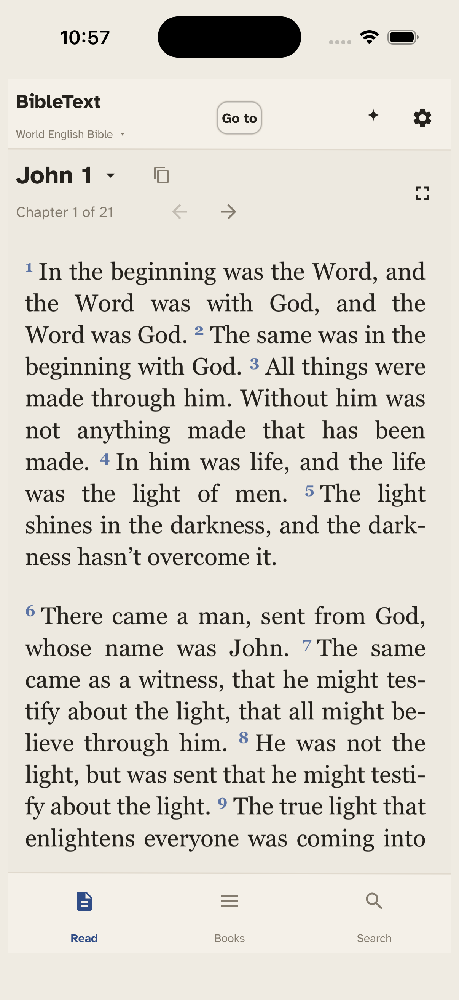
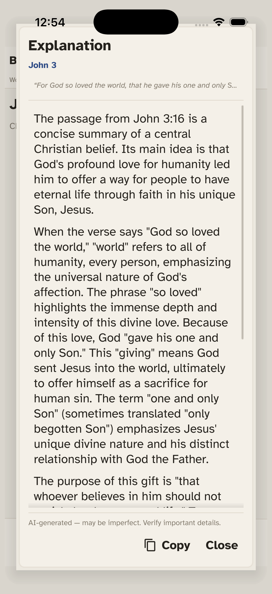
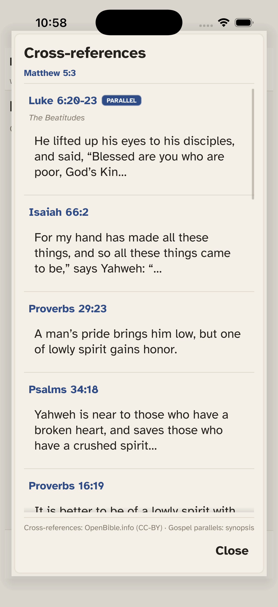

# BibleText

[](https://github.com/cubancorona/bibletext/actions/workflows/ci.yml)

A clean, modern reader for the Bible that runs on **macOS, Windows, Linux, and
iOS** from a single Go codebase, built with [Fyne](https://fyne.io/). It presents
public-domain translations — the **World English Bible (WEB)** and **Berean
Standard Bible (BSB)** — in a calm, responsive reading layout.

| Reading | Study with AI | Share as image |
|:---:|:---:|:---:|
|  |  |  |
| Distraction-free reading — words of Christ in red | Explain, context & translation notes, with your own AI key | Any verse as shareable art with a clean citation |

<details>
<summary><b>More:</b> cross-references &amp; Gospel parallels</summary>



Tap a verse to surface its cross-references (Treasury of Scripture Knowledge) and,
for a Gospel passage, the parallel accounts in the other Gospels.

</details>

## Build

You need [Go](https://go.dev/dl/) 1.21 or newer. Then, from the repo root:

```bash
go run ./cmd/desktop
```

That's the whole thing. On first launch it downloads the Bible text (~30 seconds)
and caches it locally, so every launch after that is instant and works offline.

**iOS simulator** (needs macOS + Xcode): `./scripts/run-ios-sim.sh`

<details>
<summary>Release builds, iOS device, Android, cross-compile, tests</summary>

```bash
# A standalone desktop binary
go build -o bibletext ./cmd/desktop

# Cross-compile for other desktop OSes
GOOS=linux   GOARCH=amd64 go build -o bibletext-linux   ./cmd/desktop
GOOS=windows GOARCH=amd64 go build -o bibletext.exe     ./cmd/desktop
GOOS=darwin  GOARCH=arm64 go build -o bibletext-macos   ./cmd/desktop

# iOS / Android packaging (needs the Fyne CLI: go install fyne.io/tools/cmd/fyne@latest)
cd cmd/mobile && fyne package -os iossimulator --app-id uk.co.bibletext
fyne package -os android -appID uk.co.bibletext -src ./cmd/mobile

# Tests
go test ./...
```

iOS device installs need Xcode signing; `scripts/run-ios-device.sh` wraps it (set
`BIBLETEXT_DEVICE_ID`). The iOS scripts also apply a one-line scroll-lag patch to a
local copy of Fyne — see [`patches/README.md`](patches/README.md); `go.mod` ships
stock Fyne so plain `go` commands need no setup.

</details>

## Features

- 📖 **Responsive reading** — scripture flows as a centred column that wraps to
  the window width with a comfortable line length, and superscript verse numbers.
- 🔍 **Smart search** — keyword search across every verse with the matched terms
  highlighted, plus reference lookups like `John 3:16`, `Ps 23`, or `1 Cor 13`
  (common abbreviations are understood). An exact verse reference jumps straight
  to that verse in context.
- 🧭 **Quick navigation** — filterable book list, previous/next chapter, and a
  chapter picker grid.
- 🕮 **Recent history** — a slim, unobtrusive bar of recently read chapters you
  can jump back to, or clear.
- 🌗 **Light & dark mode** — a warm "paper" light theme or an easy-on-the-eyes
  dark theme.
- 📋 **Copy** — copy the current chapter to the clipboard.
- ⌨️ **Keyboard shortcuts** (desktop) — `Cmd/Ctrl+F` focuses search, `Esc` clears.
- 📱 **Touch UI** (iOS) — bottom-tab layout (Read / Books / Search) with full-size
  touch targets; the same data, search and theme code as the desktop build.
- 🤖 **AI study** (bring your own key) — select any passage and ask an AI to
  **Explain**, **Analyze context**, or **Analyze translation** it, using your own
  Gemini / ChatGPT / Claude / Grok API key. See
  [AI study](#ai-study-bring-your-own-key) for exactly what is sent.
- 🔗 **Cross-references & Gospel parallels** — select a verse and choose
  **Cross-references** to see related passages (vote-ranked), each a tap away. For a
  Gospel verse, the same event in the other Gospels appears first, tagged
  **Parallel** (an embedded synopsis that works offline). Cross-reference data is the
  public-domain/CC-BY [OpenBible.info](https://www.openbible.info/labs/cross-references/)
  set, fetched once and cached.
- 🟥 **Red-letter mode** — show the words of Christ in red (Settings → Reading).
- ✦ **Verse of the day** — a subtle sparkle in the header opens one
  Christ-centred verse that rotates daily, with a jump to read it in context.
- 📤 **Share a verse** — from the selection menu: **Share with citation** (text +
  reference) or **Share as image** (a clean, text-only card with a dynamic colour
  treatment — no imagery; preview and regenerate before sharing). Quote and citation
  follow Bluebook style (spelled-out translation, en-dash ranges, block-quote rule).
  Both open your device's native share sheet.
- 📚 **Multiple translations** — read the public-domain **World English Bible** and
  **Berean Standard Bible**, switchable from the header; **NRSV** and **LSB** are
  wired in and become selectable once licensed. See [Bible versions](#bible-versions).

## Bible versions

The reader ships with the **World English Bible (WEB)** — a public-domain
translation, free to distribute, fetched from
[bible-api.com](https://bible-api.com/). Use the **translation switcher in the
header** (the version name beneath "BibleText") to change versions.

Two more translations are wired in:

| Version | Abbrev | Rights holder | Status |
|---|---|---|---|
| World English Bible | WEB | Public domain | ✅ Real text |
| New Revised Standard Version | NRSV | National Council of the Churches of Christ | 🔒 Evaluation in progress |
| Legacy Standard Bible | LSB | The Lockman Foundation | 🔒 Evaluation in progress |

**NRSV and LSB are copyrighted** and can't be redistributed without permission, so
in normal builds they appear in the switcher as **"Evaluation in progress — not yet
available"** and are **greyed out / not selectable** — no placeholder text is ever
shown to users. The full retrieval, cache, switching, search and AI-study path is
already wired, so each becomes a normal, selectable translation the moment a license
is configured (see [Activating a licensed version](#activating-a-licensed-version)) —
no UI or code change needed.

For internal QA before a license lands, set `BIBLETEXT_ENABLE_TESTING=1`. That
unlocks the not-yet-licensed versions with **clearly-labeled placeholder text** (e.g.
`[NRSV sample — licensed text not available in this testing build] John 1:1`) and a
**TESTING** badge, so switching, navigation, search and AI study can be exercised end
to end — without shipping copyrighted text.

### Getting a license

Two routes: go through an **API provider** that already carries the translation
(simplest — it matches the `licensedAPISource` code path), or license **directly**
from the rights holder and load the text they supply. Two real-world wrinkles to
know before you start:

- **"NRSV" in practice means the NRSVue.** The original 1989 NRSV is **no longer
  available for new licenses** (only the NRSV Catholic Edition is). License the
  **New Revised Standard Version Updated Edition (NRSVue, 2021)** instead.
- **The LSB is licensed directly, not via a public API.** The Lockman Foundation
  distributes it through per-partner agreements, so you'll most likely receive the
  text as a data file/feed rather than an API `bibleId`.

**NRSVue** — copyright: **National Council of Churches**; permissions managed by
**Petradi Rights Management**.
- Email **`NCCrights@petradirights.com`** with your use details (translation,
  verse counts, product description, distribution format, target markets, sales
  projections, timeline). Mobile-app / software use needs a paid license — it's
  outside the free-use policy and a fee applies. Hub: <https://www.friendshippress.org/>.
- Or license via an API provider that carries it (API.Bible, below) — **confirm
  it's in their catalog first.**
- Free-use (no permission needed): up to **500 verses** *and* under **25%** of your
  work, with attribution — enough for a sample/preview, not the whole text.

**LSB (Legacy Standard Bible)** — copyright: **The Lockman Foundation**, managed
with **Three Sixteen Publishing**.
- Email **`info@316publishing.com`** to set up a licensing agreement. There's no
  advertised self-serve API or data download — you agree terms and they provide the
  text for your app (which then plugs in as a file-based source — see below).
  General permissions info: <https://www.lockman.org/>.

**API.Bible (`scripture.api.bible`)** — the provider the code scaffolds against,
run by the American Bible Society; carries many popular translations. **Confirm
NRSVue (and, if ever offered, LSB) are actually in its catalog before relying on it.**
1. Sign up at <https://scripture.api.bible/> → get your **API key** from the
   dashboard once approved (sent in the `api-key` request header). This is
   `BIBLE_API_KEY`.
2. A distributed app needs **commercial** access — copyrighted translations start
   around **$10/month each**; the free Starter plan's 3 licensed Bibles are
   **non-commercial only**. Arrange commercial terms with them.
3. Get each translation's **`bibleId`**: `GET /v1/bibles` returns the Bibles your
   key can access, each with an `id`. That id is your `BIBLETEXT_PROVIDER_ID_*`.

### Activating a licensed version

Once you hold a license and have provider credentials, **no code change is
needed** — set these environment variables (the source is `licensedAPISource`
in `versions.go`, with the provider's HTTP calls ready to be filled in):

```bash
export BIBLE_API_KEY="<your provider api key>"
export BIBLETEXT_LICENSE_NRSV=1                 # explicit "we are licensed" opt-in
export BIBLETEXT_PROVIDER_ID_NRSV="<provider's bible id>"
```

The double gate — a license opt-in **and** credentials — makes it impossible to
ship copyrighted text by accident. Each version caches to its own file
(`bibletext-<id>.json`) beside the WEB cache.

Those env vars drive the **API-provider path** (`licensedAPISource`) — the right
shape for the NRSVue via API.Bible. The **LSB** arrives as licensed **data**, not an
API, so it plugs in differently: add a small file-based `bibleSource` that parses the
supplied text into `BibleData` (the `bibleSource` interface in `versions.go` is built
for exactly this — `webSource`, `licensedAPISource`, and a future `licensedFileSource`
all satisfy it, and the rest of the app is unchanged). Gate it the same way so the
real text only loads once you've dropped the licensed file in place.

## AI study (bring your own key)

Select a passage in the reader and the native selection menu gains a **Study with
AI** submenu with three actions — **Explain**, **Analyze context**, and **Analyze
translation**. The chosen action plus the selected text are sent to an AI provider
of your choice, and the answer appears in a panel.

You supply your own API key per provider. Keys are stored **only on this device**
(via the OS preferences store) — nothing is embedded in the app. Open the header
**gear → AI study** sheet to pick a provider and paste a key:

| Provider | Model | Get a key |
|---|---|---|
| Google Gemini | `gemini-2.5-flash` | <https://aistudio.google.com/apikey> |
| ChatGPT (OpenAI) | `gpt-4o-mini` | <https://platform.openai.com/api-keys> |
| Claude (Anthropic) | `claude-3-5-haiku-latest` | <https://console.anthropic.com/settings/keys> |
| Grok (xAI) | `grok-2-latest` | <https://console.x.ai> |

A `<PROVIDER>_API_KEY` environment variable (`GEMINI_API_KEY`, `OPENAI_API_KEY`,
`ANTHROPIC_API_KEY`, `XAI_API_KEY`) overrides the stored key when set.

### What gets sent

Each action builds one prompt (`buildAIPrompt` in `ai.go`) and sends it as a
single user message at temperature `0.4`, capped at `4096` output tokens.
Identical requests are cached in memory, so re-opening the same analysis does not
re-send. Only the text you selected — plus the book and chapter it came from — and
the fixed instructions below ever leave the device:

```
You are a knowledgeable, even-handed Bible study assistant. Write in clear,
plain language for a general reader and keep it concise — a few short paragraphs
at most. Where scholars disagree or a point is uncertain, say so briefly rather
than overstating. Do not use markdown headings or bullet lists.

{task}

Passage ({Book} {Chapter}):
"{selected text}"
```

`{task}` is the only part that differs per action:

- **Explain** — "Explain what the passage below means: its main idea, any imagery
  or terms a general reader might not know, and how its parts connect."
- **Analyze context** — "Explain the context of the passage below: who wrote it
  and to whom, what is happening in the surrounding narrative, and how it fits the
  historical, literary, and theological themes of `{Book}`."
- **Analyze translation** — "Discuss translation considerations for the passage
  below: notable Hebrew or Greek words behind the English, how major English
  translations render it differently, and nuances that are hard to carry into
  English. The quoted text is from the World English Bible."

The reference sent is the **book and chapter only** (e.g. `Passage (John 1)`), not
the specific verse number. The separate **Test key** button in settings sends just
`Reply with the single word: OK` to validate a key.

## Repository layout

```
bibletext/
├── go.mod                  # module bibletext
├── *.go                    # shared package: bibletext
│   ├── bible.go cache.go fetch_bible_data.go annotation.go   (pure data layer)
│   ├── state.go theme.go font.go                              (cross-platform UI scaffolding)
│   ├── sidebar.go reading.go search.go history.go ui.go       (shared widgets)
│   ├── ui_desktop.go    # //go:build !ios && !android  — HSplit + keyboard shortcuts
│   ├── ui_mobile.go     # //go:build ios  || android   — bottom tabs + touch drawer
│   └── app.go              # Run() + LoadAndPrepareState() shared entry helpers
└── cmd/
    ├── desktop/main.go     # `go build ./cmd/desktop`
    └── mobile/                # `cd cmd/mobile && fyne package -os ios`
        ├── main.go
        ├── FyneApp.toml      # bundle ID, version (read by `fyne package`)
        └── Icon.png          # 1024×1024 app icon — replace before App Store
```

The same `bibletext` package is consumed by both `cmd/` entry points; build tags
on `ui_desktop.go` / `ui_mobile.go` make the linker pick the platform-appropriate
`CreateMainUI` implementation. Pure data files (`bible.go`, `cache.go`,
`fetch_bible_data.go`, `annotation.go`) have no UI deps and compile everywhere.

## License

The application's source code is licensed under the **[Apache License 2.0](LICENSE)**.

Bundled data and assets keep their own licenses (see [NOTICE](NOTICE)):

- Scripture: **World English Bible** and **Berean Standard Bible** — public domain.
- Cross-references: **[OpenBible.info](https://www.openbible.info/labs/cross-references/)**
  Treasury of Scripture Knowledge — **CC BY**.
- UI font: **Atkinson Hyperlegible** (Braille Institute) — **SIL Open Font License 1.1**.

---

> "Your word is a lamp to my feet and a light to my path." — Psalm 119:105
