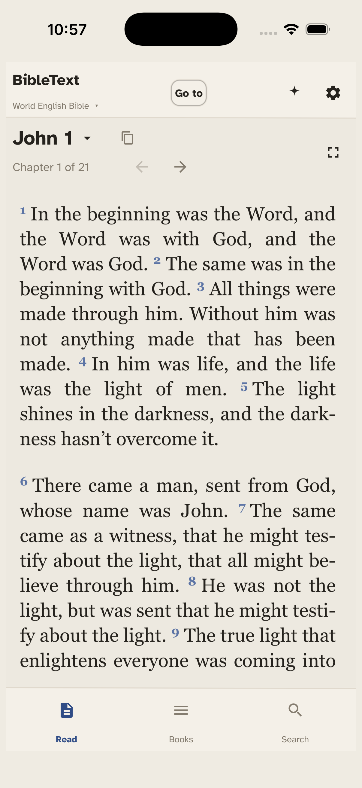
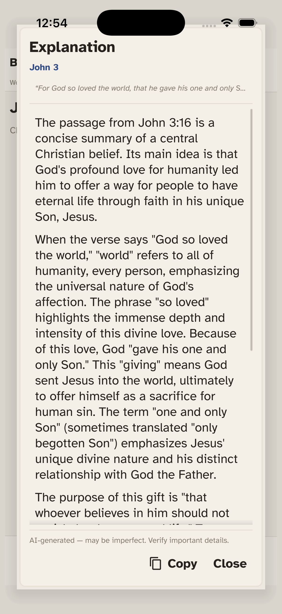
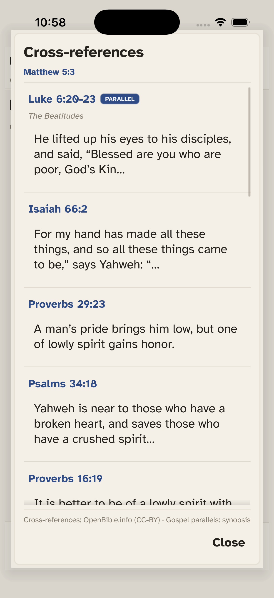

# BibleText

[](https://github.com/cubancorona/bibletext/actions/workflows/ci.yml)

A clean, modern reader for the Bible that runs on **macOS, Windows, Linux, iOS,
and Android** from a single Go codebase, built with [Fyne](https://fyne.io/). It presents
public-domain translations — the **World English Bible (WEB)**, its **Catholic
edition (WEBC)** with the deuterocanon, and the **Berean Standard Bible (BSB)** —
in a calm, responsive reading layout, with poetry set as poetry.

| Reading | Study with AI | Share as image |
|:---:|:---:|:---:|
|  |  |  |
| Distraction-free reading — words of Christ in red | Explain, context & translation notes, with your own AI key | Any verse as shareable art with a clean citation |

<details>
<summary><b>More:</b> cross-references &amp; Gospel parallels</summary>



Tap a verse to surface its cross-references (Treasury of Scripture Knowledge) and,
for a Gospel passage, the parallel accounts in the other Gospels.

</details>

## Download

**[bibletext download page](https://bibletext.co.uk/)** — all
platforms in one place, or directly:

- **iPhone & iPad** — [App Store](https://apps.apple.com/app/id6784567351)
- **Android** — [sideload APK](https://github.com/cubancorona/bibletext/releases/latest/download/BibleText-Android.apk)
  from Releases (built + signed locally by `scripts/build-android.sh --release`,
  uploaded per release; Play Store listing prepared in
  [docs/PLAY_LISTING.md](docs/PLAY_LISTING.md), pending a Play Console account)
- **macOS / Windows / Linux** — grab the latest build from
  [Releases](https://github.com/cubancorona/bibletext/releases/latest)
  (the desktop apps are unsigned: on macOS, right-click → **Open** the first
  time). Desktop artifacts are built by
  [`release.yml`](.github/workflows/release.yml) on every `v*` tag.

## Build

You need [Go](https://go.dev/dl/) 1.21 or newer, plus a C compiler (Fyne uses cgo):
on macOS the Xcode Command Line Tools (`xcode-select --install` — Intel and Apple
Silicon both work); on Linux also the GL/X11 headers:

```bash
sudo apt-get install gcc libgl1-mesa-dev xorg-dev libxkbcommon-dev   # Debian/Ubuntu
```

Then, from the repo root:

```bash
go run ./cmd/desktop
```

That's the whole thing. A first run opens immediately on an embedded Gospels seed
and downloads the complete Bible in the background (~30 seconds), caching it
locally — so every launch after that is instant and works offline.

**iOS simulator** (needs macOS with full Xcode, an iOS simulator runtime, and the
Fyne CLI — the script checks and tells you what's missing): `./scripts/run-ios-sim.sh`

**Android** (needs a JDK, the Android SDK + NDK, and the Fyne CLI — setup in
[docs/ANDROID.md](docs/ANDROID.md)): `./scripts/build-android.sh` produces an
installable debug APK.

<details>
<summary>Release builds, iOS device, Android, cross-compile, tests</summary>

```bash
# A standalone desktop binary (native for your OS/arch — Intel and Apple Silicon both fine)
go build -o bibletext ./cmd/desktop

# macOS: build for the other Mac architecture (cgo needs the explicit opt-in)
CGO_ENABLED=1 GOARCH=arm64 go build -o bibletext-macos-arm64 ./cmd/desktop
CGO_ENABLED=1 GOARCH=amd64 go build -o bibletext-macos-amd64 ./cmd/desktop

# Linux/Windows builds: Fyne uses cgo, so a bare GOOS=… cross-build won't work —
# build natively on each OS, or use fyne-cross (https://github.com/fyne-io/fyne-cross).

# iOS packaging (needs the Fyne CLI: go install fyne.io/tools/cmd/fyne@latest)
cd cmd/mobile && fyne package -os iossimulator --app-id uk.co.bibletext

# Android — always via the wrapper script (a bare `fyne package -os android`
# drops the native reading overlay and the background-audio service):
./scripts/build-android.sh              # debug APK
./scripts/build-android.sh --release    # signed .aab + universal APK

# Tests
go test ./...
```

iOS device installs need Xcode signing; `scripts/run-ios-device.sh` wraps it (set
`BIBLETEXT_TEAM_ID` to your own Apple Developer team id, and optionally
`BIBLETEXT_DEVICE_ID` to pick a specific device). The iOS scripts also apply two
small Fyne patches to a local copy (a scroll-lag fix and a caret-blink battery
fix) — see [`patches/README.md`](patches/README.md); `go.mod` ships stock Fyne so
plain `go` commands need no setup.

Android toolchain setup (JDK 21, SDK + NDK — all installable under `$HOME`, no
root), signing, emulator use, and distribution are covered in
[docs/ANDROID.md](docs/ANDROID.md).

</details>

## Features

- 📖 **Responsive reading** — scripture flows as a centred column that wraps to
  the window width with a comfortable line length, and superscript verse numbers.
- 🔍 **Smart search** — keyword search across every verse with the matched terms
  highlighted, plus reference lookups like `John 3:16`, `Ps 23`, or `1 Cor 13`
  (common abbreviations are understood). An exact verse reference jumps straight
  to that verse in context.
- 🧭 **Quick navigation** — filterable book list, previous/next chapter, and a
  chapter picker grid.
- 🕮 **Recent history** — a slim, unobtrusive bar of recently read chapters you
  can jump back to, or clear.
- 🌗 **Light & dark mode** — a warm "paper" light theme or an easy-on-the-eyes
  dark theme.
- 📋 **Copy** — copy the current chapter to the clipboard.
- ⌨️ **Keyboard shortcuts** (desktop) — `Cmd/Ctrl+F` focuses search, `Esc` clears.
- 📱 **Touch UI** (iOS & Android) — bottom-tab layout (Read / Books / Search) with
  full-size touch targets and native text selection (a real `UITextView` /
  `TextView` reading pane); the same data, search and theme code as the desktop
  build.
- 🖥️ **iPad layout** — on a wide iPad canvas the app switches at runtime to a
  desktop-style two-pane layout: a navigation sidebar (search, Find, book list)
  beside the reading pane, with a header toggle to hide the sidebar for
  full-width reading (shown in landscape, tucked away in portrait by default).
  Narrow Split View / Slide Over columns fall back to the phone layout
  automatically. The reading page itself is typeset like a classic book —
  a centred text column with generous margins, comfortable line spacing, and
  indented paragraphs, modelled on the U.S. Reports (the Supreme Court's
  official reporter). See [docs/IPAD.md](docs/IPAD.md).
- 🤖 **AI study** (bring your own key) — select any passage and have an AI
  **Explain** it, **Analyze context**, or **Analyze translation**, using your own
  Gemini / ChatGPT / Claude / Grok API key. There's also an AI **Find** that turns
  a plain-language request into matching passages on the Search tab. Optional and
  off-able (Settings → Assistant → None). See [AI study](#ai-study-bring-your-own-key)
  for exactly what is sent.
- 🔗 **Cross-references & Gospel parallels** — select a verse and choose
  **Cross-references** to see related passages (vote-ranked), each a tap away. For a
  Gospel verse, the same event in the other Gospels appears first, tagged
  **Parallel** (an embedded synopsis that works offline). Cross-reference data is the
  public-domain/CC-BY [OpenBible.info](https://www.openbible.info/labs/cross-references/)
  set, fetched once and cached.
- 🎧 **Listen** (all platforms) — play the current chapter from the reading
  header as a recorded human **narration** or on-device **read-aloud**
  (text-to-speech) of the verses on screen. The **Berean Standard Bible** (Barry
  Hays) and the **World English Bible** (David Williams) both have complete
  public-domain narrations, streamed from the project's own
  [audio mirror](https://github.com/cubancorona/bibletext-audio); everything
  else falls back to read-aloud — all fetched only when you press play. A **person**
  icon marks a recording and a **waveform** marks read-aloud; tap it to choose the
  source. **Read-along**: a floating *Follow narration* button keeps the page in
  sync, highlighting each verse as it is spoken. When a chapter finishes, playback
  continues to the **next chapter** automatically until you pause. On the phones
  (iOS and Android) audio keeps playing while the app is backgrounded or the screen
  is locked, with lock-screen / notification controls and ±15-second skip. On
  Windows and Linux the recorded narrations play too, with ±15s skip,
  continuous chapters, and the same read-along verse highlighting;
  on-device read-aloud (TTS) remains a native-platform feature
  (iOS / Android / macOS).
- 📜 **Poetry as poetry** — the poetic books (Psalms, Proverbs, Job, the
  prophets' oracles, the embedded songs) display their authored verse lines —
  one poetic line per line, ragged-right, breaking at every verse boundary
  inside a poem, as in print — in all three translations, on every platform.
  Text shares, chapter copies, and the verse of the day keep the same lines.
- 🟥 **Red-letter mode** — the words of Christ in red, on by default and
  switchable in Settings → Reading (iOS, Android, and macOS; the Windows/Linux
  reading pane is a single styled widget that cannot colour a text range, so the
  switch is hidden there).
- ✦ **Verse of the day** — a subtle sparkle in the header opens one
  Christ-centred verse that rotates daily, with a jump to read it in context.
- 📤 **Share a verse** — from the selection menu: **Share with citation** (text +
  reference) or **Share as image** (a clean, text-only card — no imagery — with a
  dynamic colour treatment and elegant serif typesetting; preview first, and
  **Regenerate** walks 13 colour schemes × 7 embedded book serifs — Gelasio, Cardo,
  Crimson Text, Spectral, Libre Baskerville, Prata, and DM Serif Display — 91
  distinct pairings, identical on every platform). Quote and citation follow
  **Bluebook** style: spelled-out translation, en-dash ranges, and the Rule 5
  quotation rules (the 50-word block-quote threshold, quotation nesting, bracketed
  capitals, and " . . . ." end omissions). Ragged drag edges are tidied — a
  selection cut mid-word trims to the whole word, stray verse-number markers
  never leak into the quote, and the citation always names exactly the verses
  the shared words come from. Text shares retain source poetry lines and reading
  paragraphs, but never line breaks caused only by screen wrapping. Both open
  your device's native share sheet.
- 📚 **Multiple translations** — read three public-domain translations: the **World
  English Bible** (WEB), the **Berean Standard Bible** (BSB), and the **World English
  Bible (Catholic)** with the 73-book deuterocanon — switchable from the header.
  **NRSV**, **LSB** and **NKJV** are wired in and become selectable once licensed. See
  [Bible versions](#bible-versions).

## Bible versions

The reader ships with three public-domain translations — the **World English Bible
(WEB)**, the **Berean Standard Bible (BSB)**, and the **World English Bible
(Catholic)** (WEB plus the 73-book deuterocanon) — all free to distribute and fetched
in a single request each from the free, key-less
[bible.helloao.org](https://bible.helloao.org/). Use the **translation switcher in
the header** (the version name beneath "BibleText") to change versions. Three licensed
translations (**NRSV**, **LSB**, **NKJV**) are wired in and become selectable once
licensed:

| Version | Abbrev | Rights holder | Status |
|---|---|---|---|
| World English Bible | WEB | Public domain | ✅ Real text |
| Berean Standard Bible | BSB | Public domain (CC0) | ✅ Real text |
| World English Bible (Catholic) | WEBC | Public domain | ✅ Real text |
| New Revised Standard Version | NRSV | National Council of the Churches of Christ | 🔒 Evaluation in progress |
| Legacy Standard Bible | LSB | The Lockman Foundation | 🔒 Evaluation in progress |
| New King James Version | NKJV | Thomas Nelson (HarperCollins Christian) | 🔒 Evaluation in progress |

**NRSV, LSB and NKJV are copyrighted** and can't be redistributed without permission, so
in normal builds they appear in the switcher as **"Evaluation in progress — not yet
available"** and are **greyed out / not selectable** — no placeholder text is ever
shown to users. The full retrieval, cache, switching, search and AI-study path is
already wired, so each becomes a normal, selectable translation the moment a license
is configured (see [Activating a licensed version](#activating-a-licensed-version)) —
no UI or code change needed.

For internal QA before a license lands, set `BIBLETEXT_ENABLE_TESTING=1`. That
unlocks the not-yet-licensed versions with **clearly-labeled placeholder text** (e.g.
`[NRSV sample — licensed text not available in this testing build] John 1:1`) and a
**TESTING** badge, so switching, navigation, search and AI study can be exercised end
to end — without shipping copyrighted text.

### Getting a license

Two routes: go through an **API provider** that already carries the translation
(simplest — it matches the `licensedAPISource` code path), or license **directly**
from the rights holder and load the text they supply. Two real-world wrinkles to
know before you start:

- **"NRSV" in practice means the NRSVue.** The original 1989 NRSV is **no longer
  available for new licenses** (only the NRSV Catholic Edition is). License the
  **New Revised Standard Version Updated Edition (NRSVue, 2021)** instead.
- **The LSB is licensed directly, not via a public API.** The Lockman Foundation
  distributes it through per-partner agreements, so you'll most likely receive the
  text as a data file/feed rather than an API `bibleId`.

**NRSVue** — copyright: **National Council of Churches**; permissions managed by
**Petradi Rights Management**.
- Email **`NCCrights@petradirights.com`** with your use details (translation,
  verse counts, product description, distribution format, target markets, sales
  projections, timeline). Mobile-app / software use needs a paid license — it's
  outside the free-use policy and a fee applies. Hub: <https://www.friendshippress.org/>.
- Or license via an API provider that carries it (API.Bible, below) — **confirm
  it's in their catalog first.**
- Free-use (no permission needed): up to **500 verses** *and* under **25%** of your
  work, with attribution — enough for a sample/preview, not the whole text.

**LSB (Legacy Standard Bible)** — copyright: **The Lockman Foundation**, managed
with **Three Sixteen Publishing**.
- Email **`info@316publishing.com`** to set up a licensing agreement. There's no
  advertised self-serve API or data download — you agree terms and they provide the
  text for your app (which then plugs in as a file-based source — see below).
  General permissions info: <https://www.lockman.org/>.

**API.Bible (`scripture.api.bible`)** — the provider the code scaffolds against,
run by the American Bible Society; carries many popular translations. **Confirm
NRSVue (and, if ever offered, LSB) are actually in its catalog before relying on it.**
1. Sign up at <https://scripture.api.bible/> → get your **API key** from the
   dashboard once approved (sent in the `api-key` request header). This is
   `BIBLE_API_KEY`.
2. A distributed app needs **commercial** access — copyrighted translations start
   around **$10/month each**; the free Starter plan's 3 licensed Bibles are
   **non-commercial only**. Arrange commercial terms with them.
3. Get each translation's **`bibleId`**: `GET /v1/bibles` returns the Bibles your
   key can access, each with an `id`. That id is your `BIBLETEXT_PROVIDER_ID_*`.

### Activating a licensed version

Once you hold a license and have provider credentials, **no code change is
needed** — set these environment variables (the source is `licensedAPISource`
in `versions.go`, with the provider's HTTP calls ready to be filled in):

```bash
export BIBLE_API_KEY="<your provider api key>"
export BIBLETEXT_LICENSE_NRSV=1                 # explicit "we are licensed" opt-in
export BIBLETEXT_PROVIDER_ID_NRSV="<provider's bible id>"
```

The double gate — a license opt-in **and** credentials — makes it impossible to
ship copyrighted text by accident. Each version caches to its own file
(`bibletext-<id>.json`) beside the WEB cache.

Those env vars drive the **API-provider path** (`licensedAPISource`) — the right
shape for the NRSVue via API.Bible. The **LSB** arrives as licensed **data**, not an
API, so it plugs in differently: add a small file-based `bibleSource` that parses the
supplied text into `BibleData` (the `bibleSource` interface in `versions.go` is built
for exactly this — `webSource`, `licensedAPISource`, and a future `licensedFileSource`
all satisfy it, and the rest of the app is unchanged). Gate it the same way so the
real text only loads once you've dropped the licensed file in place.

## AI study (bring your own key)

Select a passage in the reader and the native selection menu gains a **Study with
AI** submenu with three actions — **Explain**, **Analyze context**, and **Analyze
translation**. The chosen action plus the selected text are sent to an AI provider
of your choice, and the answer appears in a panel. (A free-form **Ask a question…**
verb also exists in the code but is not currently surfaced in the menu.) The whole
AI surface can be turned off in Settings → Assistant → **None**. A separate AI
**Find** on the Search
tab (the **Search / Find** toggle) takes a plain-language request and returns
matching passages — using only the references the model names, with the verse text
coming from the app's own Bible data. AI answers carry a **Report** button (to flag
any output) and the AI-settings sheet shows an in-app note explaining what leaves
the device.

You supply your own API key per provider. Keys are stored **only on this device**
— in the Apple Keychain on iOS (encrypted at rest, and carried across an encrypted
backup or a move to a new device) and in the local preferences store on macOS,
Windows, Linux, and Android — nothing is embedded in the app. Open the header
**gear → AI study** sheet to pick a provider and paste a key:

| Provider | Model | Get a key |
|---|---|---|
| Google Gemini | `gemini-pro-latest` (faster: `gemini-2.5-flash`) | <https://aistudio.google.com/apikey> |
| ChatGPT (OpenAI) | `gpt-5` (faster: `gpt-4o-mini`) | <https://platform.openai.com/api-keys> |
| Claude (Anthropic) | `claude-opus-5` (faster: `claude-haiku-4-5`) | <https://platform.claude.com/settings/keys> |
| Grok (SpaceXAI) | `grok-4.5` (faster: `grok-4.3`) | <https://console.x.ai> |

The **Model** dropdown in the same sheet is populated live from your provider's
own model list (fetched with your key), so new models appear the day they ship —
pick one to pin it, or leave **Recommended** to use the default above, which
self-heals automatically if the provider retires it.

A `<PROVIDER>_API_KEY` environment variable (`GEMINI_API_KEY`, `OPENAI_API_KEY`,
`ANTHROPIC_API_KEY`, `XAI_API_KEY`) overrides the stored key when set.

### What gets sent

Each action builds one prompt (`buildAIPrompt` in `ai.go`) and sends it as a
single user message. Output is limited only by a `32768`-token runaway backstop
— the prompt, not a spending cap, is what keeps answers short (a lower cap
silently starved the reasoning models, which count their hidden thinking against
it). Gemini and Grok requests are sent at temperature `0.4`, ChatGPT too except
its reasoning families (`gpt-5`, `o*`), which — like Claude — use the provider's
default. Identical requests are cached in memory, so re-opening the same
analysis does not re-send. Only the text you selected — plus the book and chapter it came from — and
the fixed instructions below ever leave the device:

```
You are a knowledgeable, even-handed Bible study assistant. Write in clear,
plain language for a general reader and keep it concise — a few short paragraphs
at most. Where scholars disagree or a point is uncertain, say so briefly rather
than overstating. Do not use markdown headings or bullet lists.

{task}

Passage ({Book} {Chapter}):
"{selected text}"
```

`{task}` is the only part that differs per action:

- **Explain** — "Explain what the passage below means: its main idea, any imagery
  or terms a general reader might not know, and how its parts connect."
- **Analyze context** — "Explain the context of the passage below: who wrote it
  and to whom, what is happening in the surrounding narrative, and how it fits the
  historical, literary, and theological themes of `{Book}`."
- **Analyze translation** — "Discuss translation considerations for the passage
  below: notable Hebrew or Greek words behind the English, how major English
  translations render it differently, and nuances that are hard to carry into English. The quoted text is
  from the {Version}." (the name of the active translation — e.g. the World English
  Bible or the Berean Standard Bible)

The reference sent is the **book and chapter only** (e.g. `Passage (John 1)`), not
the specific verse number. The separate **Test key** button in settings sends just
`Reply with the single word: OK` to validate a key.

## Repository layout

```
bibletext/
├── go.mod                  # module bibletext
├── *.go                    # shared package: bibletext
│   ├── bible.go cache.go fetch_bible_data.go annotation.go   (pure data layer)
│   ├── state.go theme.go font.go                              (cross-platform UI scaffolding)
│   ├── sidebar.go reading.go search.go history.go ui.go       (shared widgets)
│   ├── ui_desktop.go    # //go:build !ios && !android  — HSplit + keyboard shortcuts
│   ├── ui_mobile.go     # //go:build ios  || android   — bottom tabs (compact) + runtime layout pick
│   ├── ui_regular.go    # //go:build ios  || android   — iPad sidebar+split (regular) layout
│   ├── layout.go device_ios.go device_other.go               (compact/regular runtime classifier)
│   ├── reading_macos.go reading_ios.go reading_android.go     (native reading overlays)
│   ├── audio_macos.go audio_ios.go audio_android.go           (native audio engines)
│   └── app.go              # Run() / NewLoadingState() / StartBackgroundLoad() entry helpers
├── android/                # Java half of the Android bridge (compiled to
│   │                       # classes2.dex by scripts/build-android.sh)
│   ├── BtBridge.java       # selectable reading overlay + selection menu + share
│   ├── BtAudio.java        # MediaPlayer + TextToSpeech engine
│   └── BtAudioService.java # foreground service — background/lock-screen playback
├── scripts/                # build wrappers: build-android.sh, run-ios-*.sh, release-ios.sh
├── docs/ANDROID.md         # Android toolchain, build, signing, distribution
├── docs/IPAD.md            # the iPad regular-width layout: design, testing, shipping
└── cmd/
    ├── desktop/main.go     # `go build ./cmd/desktop`
    └── mobile/                # iOS: scripts/run-ios-*.sh · Android: scripts/build-android.sh
        ├── main.go
        ├── FyneApp.toml         # bundle ID, version/build (read by `fyne package`)
        ├── AndroidManifest.xml  # custom manifest — media service + session permissions
        └── Icon*.png            # app icon + Android adaptive-icon layers
```

The same `bibletext` package is consumed by both `cmd/` entry points; build tags
on `ui_desktop.go` / `ui_mobile.go` make the linker pick the platform-appropriate
`CreateMainUI` implementation. Pure data files (`bible.go`, `cache.go`,
`fetch_bible_data.go`, `annotation.go`) have no UI deps and compile everywhere.

## License

The application's source code is licensed under the **[Apache License 2.0](LICENSE)**.

Bundled data and assets keep their own licenses (see [NOTICE](NOTICE)):

- Scripture: **World English Bible** and **Berean Standard Bible** — public domain
  (via [bible.helloao.org](https://bible.helloao.org/)).
- Audio narration: **BSB** by Barry Hays (**CC0**) and **WEB** by David Williams
  (**public domain**), streamed from the project's
  [audio mirror](https://github.com/cubancorona/bibletext-audio).
- Cross-references: **[OpenBible.info](https://www.openbible.info/labs/cross-references/)**
  Treasury of Scripture Knowledge — **CC BY**.
- UI font: **Atkinson Hyperlegible** (Braille Institute) — **SIL Open Font License 1.1**.
- Share-card serifs: **Gelasio, Cardo, Crimson Text, Spectral, Libre Baskerville,
  Prata, DM Serif Display** — all **SIL OFL 1.1** (`assets/fonts/share/OFL-LICENSES.txt`).

---

> "Your word is a lamp to my feet and a light to my path." — Psalm 119:105
