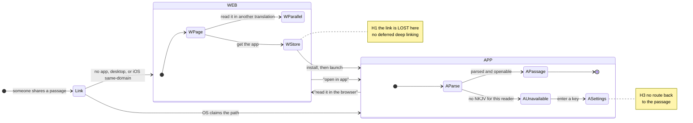

# The shared-link flow, as a state machine

> **Status.** Sections marked **[OBSERVED]** describe code that exists today, with
> `file:line`. Sections marked **[DESIGN]** describe work that is planned and not
> yet built. Do not read a **[DESIGN]** paragraph as a description of the app.
>
> This document exists because the flow outgrew the ability to hold it in one
> head. Someone is sent a verse; what they end up looking at depends on at least
> a dozen independent conditions — which surface they are on, whether the app is
> installed, whether they have an API.Bible key, whether the NKJV is cached,
> whether a download is already running, whether the passage even exists in the
> translation they have. The combinations that go wrong are not exotic; several
> of them are the *most likely* journey for a new reader.

## Why a state machine and not a checklist

A **blocked state** is one where the reader is shown something with no way
forward: a spinner that never resolves, a card whose every button dead-ends, a
page with no actionable link, a link the app claims and then silently drops.

This project has shipped several. They are recorded below not as an apology but
because each one was invisible until the whole space was enumerated, and the next
one will be too. The rule this document exists to enforce:

> **Every state must offer at least one action that reaches a state where the
> reader is reading something.**

## The surfaces, and the handoffs between them

Most of the damage is not inside a surface. It is at the seams.

### The five handoffs, and what each loses [OBSERVED]

| # | Handoff | What happens today |
|---|---|---|
| **H1** | web → App Store → install → app | **The link is lost entirely.** No pasteboard capture, no deferred deep linking anywhere in the repo. A reader sent John 3:16, who does not have the app, installs it and opens it — and lands on the default chapter with no sign a passage was ever shared. This is the *most likely* journey for a new reader, and it is the one that works worst. |
| **H2** | app → web ("Read it in the browser") | `openLinkInBrowser` is handed the raw URL unchanged (`share_link_browser_ios.go:18`, `share_link_browser_other.go:18`, `reading_android.go:600`). For `/nkjv/` that is a live 404, so the card's own promise is false for exactly the translation whose pages do not exist. |
| **H3** | app → Settings → key entered | Nothing returns the reader to the passage. `bibleKeySection`'s `onKeyPresence` callback only re-fits the sheet (`ai_settings.go:622-627`); no parked link is retried and no offer is made. The reader must go and find the original message again. |
| **H4** | web → app ("Open in app") | **Partly built, Batch 2.** Still cannot work as a plain link on iOS: no custom URL scheme is registered anywhere — `cmd/mobile/AndroidManifest.xml` declares only `https` app links and there is no `CFBundleURLTypes` in the repo or the packaging scripts — and a Universal Link does **not** open the app when the reader is already in Safari on the same domain. What the notice pages ship instead, with no app change (`cmd/websitegen/notice.go` → `openInApp`, `notice_assets.go` → `noticeJS`): **Android** gets an `intent://…;package=uk.co.bibletext;S.browser_fallback_url=…` link, which really does open the app — but the intent grammar has no room for the target's own fragment, so **the verse and the note do not cross** (I4 still open on that branch). **iOS** gets Apple's Smart App Banner (`<meta name="apple-itunes-app">`, `app-argument` = the canonical chapter URL) plus a button to the App Store product page, whose own button reads OPEN when the app is installed; the page says so out loud rather than pretending. **Desktop** gets the download, which is also the server-rendered default and therefore what a reader with scripting off gets everywhere. Registering a scheme later changes one branch of `noticeJS` and no markup. |
| **H5** | app cannot parse → OS should fall back | iOS never gets the chance. `share_link_ios.go:67` returns `YES` unconditionally and the Go result is discarded before it can reach the OS (`share_link_export_apple.go:24-26`, `share_link_open.go:327-333`). Only the pasted-link path reads the bool (`state.go:621-630`). |

The pattern is worth stating plainly: **every handoff between web and app loses
the passage.** Fixing them individually will keep producing this class of bug;
the invariant below is the general form.

## State variables

### App [OBSERVED]

| Variable | Values | How the code knows |
|---|---|---|
| `loadPhase` | `loadReady` (also the zero value, so a bare `AppState` is "ready") / `loadPending` / `loadFailed` | `state.go:208-214`, `app.go:182-232`. `HandleShareLink` parks for **any** value other than ready — including `loadFailed`, where nothing consumes it until a Retry succeeds. |
| `seedOnly` | on the embedded four-book WEB Gospels / not | `app.go:114-140`. True only when the cache missed **and** there is no saved reading state **and** the seed decoded. |
| `fullPending` | a background full download is due / not | `app.go:77`. `seeded \|\| !versionCacheIsCurrent(version)` — deliberately wider than `seedOnly`, because a stale-epoch boot serves a complete *previous* canon. |
| `versionLoading` | a translation fetch owns the spinner / not | `share_link_open.go` declines to park behind it, which is where two of the silent-nothing states come from. |
| **NKJV cached** | absent / present (current epoch) / present (superseded epoch) | `state.loadedVersions["nkjv"]`, plus `versionCacheIsCurrent`. A superseded epoch still opens — `supersededCachePaths` — so "cached" is not binary. |
| **key state** | none / bundled / reader's own — and, orthogonally, unverified / accepted / rejected / quota spent | `bible_key_bundled.go`, `bible_key_settings.go`, `newBYOKLicensedSource("nkjv", …)` in `versions.go`. **The app cannot distinguish the last three at the point of failure** — see `B_NKJV_FETCH_FAILS`. |
| `canSelect()` | selectable / "evaluation in progress" | `versions.go:75`. Note it is true whenever a key exists, which is why a silent downgrade can still happen with a key present. |
| network | — | **The app cannot observe this at all.** It learns only that a fetch failed, which is why one message covers three causes. |
| `notesFeatureOn` | on (default) / off | `notes_setting.go:34-40`. |
| link carries a note | yes / no | `ShareTarget.Note`, decoded from the fragment. |
| target passage | `verseMapExact` / `Moved` / `Absent` / `Incommensurable` | `MapVerse`. Measured: a WEBC note has no home in WEB for **378** verses; anything → WEBC for **167** (Greek Esther); web/nkjv → bsb for **12**. |
| book in the loaded canon | present / absent (seed) / absent (canon) | `GetChaptersForBook`, asked **after** the version switch. |

### Web [OBSERVED]

| Variable | Values | Notes |
|---|---|---|
| what the server sees | the path only | **Never the fragment** — so never the verse, and never the note. Any parallel-passage or note-carrying affordance must be built client-side. |
| JS | on / off | With JS off a single verse still highlights via CSS `:target`, but a **range does not, and the note does not appear at all** — `readerJSTemplate`'s own header calls this "a real degradation, not a cosmetic one". |
| platform | iOS / Android / desktop | Determines whether an "open in app" affordance is even possible (H4). |
| app installed | **undetectable** | A page cannot know. Any design that branches on it is unbuildable. |
| unfurler | iMessage / WhatsApp / Slack | Runs no JS, follows no fragment. Sees only what the server renders. |

## Blocked states [OBSERVED]

Fifteen were found. **Ten are now fixed** — the six in Batch 1 plus the park-stealing regression, and three more on the web in Batch 2; the rest are listed with what is planned. Grouped by the journey that reaches them.

**Fresh install — the flagship failure. ALL FIXED, Batch 1, 2026-08-14.**
- `B_SEED_PARK_OFFLINE` — **fixed.** The park now shows the card, using the "Shared in …" line the code was already composing and discarding. 62 of the 66 books stopped failing silently.
- `B_SEED_SECOND_LINK` — **fixed.** Last tap wins: the guard moved from "the slot is empty" to `pendingLinkVersion == ""`, so it still refuses to steal a target waiting on a translation, and the replacement is acknowledged.
- `B_LOADFAILED_PARK` — **fixed.** `buildLoadErrorView` names the waiting passage, deliberately without promising *when* — the reader is the one who taps Retry, and the load may fail again.
- `B_FULLDL_STEALS_PARK` — **fixed 2026-08-14** (`consumeSeedParkedLink`, `app.go`). Recorded because it was introduced *while fixing something else*: the consumer lacked the version check the parker and `applyLoadedVersion` both had.

**Races. BOTH FIXED, Batch 1, 2026-08-14.**
- `B_SILENT_DOWNGRADE` — **fixed.** `switchToLinkVersion` now parks behind the running load with `pendingLinkVersion` set, and `applyLoadedVersion`'s existing check decides: consume when the arriving id matches, drop when it does not. No new machinery.
- `B_SILENT_NOTHING` — **fixed.** The canon check's `if` had no `else`; a book no download can supply now says so (`linkBookUnavailableMessage`) instead of returning in silence.

**Licensed translation.**
- `B_NKJV_FETCH_FAILS` — offline, revoked key and exhausted quota all produce *the same sentence*. The reader cannot tell which, so cannot act. Nothing un-parks.
- `B_UNAVAILABLE_NO_ROUTE` — no key, `/nkjv/` link, book present: the card names the translation and stops. One OK button, no route, though the NKJV is one key away in Settings.

**Web. THREE FIXED, Batch 2, 2026-08-14** (`cmd/websitegen/notice.go` — one renderer, two placements).
- `B_WEB_404` — **fixed.** All 1,189 `/nkjv/` chapters plus the version and book indexes are generated. Each names the passage, says the text is not published here, carries an explicit open-in-app affordance worded together with that explanation, and offers the same passage in the three published translations. **No NKJV text on any of them** — not in the body, not in `og:description`, not in the title beyond the reference.
- `B_UNFURL_NKJV` — **fixed.** The preview now reads *"John 3 (New King James Version)"* with a description naming the passage and the two routes. Pre-rendered, because unfurlers run no JavaScript.
- `B_DEUTERO_WEB_404` — **fixed.** `writeVersion`'s `if len(chapters) == 0 { continue }` is gone; it now walks the site's CANON UNION and writes a notice page at every path another published translation serves. That is 139 per Protestant tree: the seven deuterocanonical books' 137 chapters **and Daniel 13-14**, a gap nobody had listed because it hides inside a book the translation does have. The dead sentence in `chapterBody` was **retired, not reused** — it named neither the book nor the translation and offered no way out, so it could not satisfy I1; the branch now returns `""` with a comment pointing at `renderNotice`.
- `B_JS_OFF` — **still open, and deliberately not made worse.** The note lives only in the fragment and only `reader.js` decodes it, so a note-bearing link with scripting off still shows no note. The notice pages therefore LOAD `reader.js` (unchanged bytes) and carry an empty `<article class="text">` purely so its `anchorToPassage` puts the note in the right place instead of under the footer — the note matters more here than anywhere, because the reader cannot see the verse. With scripting off a notice page still names the chapter, still offers the app, and still links the parallel chapter; only the verse-level precision and the note are lost, which is exactly the pre-existing degradation.

**Notes.**
- `B_NOTE_OFFER_404` — the card's primary button opens the 404 (H2), and drops the note on that branch.
- `B_NOTE_NO_COUNTERPART` — `noteFromAnotherTranslation` skips any candidate whose `MapVerse` result is absent or incommensurable, so the note is not returned at all: no separator, no explanation, no trace. It is still in the store and unreachable from the reading view.

**Platform.**
- `B_IOS_SWALLOW` — **fixed, Batch 1, 2026-08-14.** `deliverShareLink` answers synchronously (`ParseShareLink` is pure, so the answer needs no UI thread) and both ObjC entry points return it. Verified by a real ios/arm64 cross-compile, not by reading.

## Invariants

These are what the accompanying test enforces. A change that breaks one is a
regression even if every existing test stays green.

- **I1 — Liveness.** Every state offers at least one action reaching a state where the reader is reading something.
- **I2 — No claim without an answer.** If the app claims a link it must do something visible; if it cannot handle it, it must *decline* so the OS falls back to the browser. (Violated: `B_IOS_SWALLOW`.)
- **I3 — The note is never silently dropped.** A note that cannot be shown must be stored and reachable, and the reader told where it went. (Violated: `B_NOTE_NO_COUNTERPART`, `B_NOTE_OFFER_404`.)
- **I4 — A handoff carries the passage.** Crossing between web and app must not lose which verse was shared. (Violated by all five handoffs.)
- **I5 — Distinguishable failures.** Two failures a reader would act on differently must not share one message. (Violated: `B_NKJV_FETCH_FAILS`.)
- **I6 — No branch on the unobservable.** No state may depend on a condition the code cannot determine (network reachability, app-installed).

## What the test proves, and what it cannot

`share_link_flow_test.go` walks the cross-product of the app-side variables — 48
states — driving `HandleShareLink` from a real URL, and asserts I1: every state
opens the passage, says something, or parks a target that will do one of those.
The four that do none of it are pinned by name, and the assertion is on set
*equality*, so it fails when a dead end appears **and** when one is fixed without
being struck off here and in this document.

It is mechanically checked: introducing a new dead end takes the blocked count
from 4 to 26 and turns it red.

**It cannot reach the handoffs.** H1–H5 are OS and platform behaviour — an App
Store install, Safari's same-domain rule, whether the OS offers a browser
fallback. No host test observes those, so they are asserted here by inspection
with `file:line`, and their Go-side halves become testable only as they are
fixed: H5 needs `HandleShareLink`'s bool threaded back before "did the app
decline?" is a question code can ask, and H2 needs the browser URL gated on
`webPublishedVersionIDs` before "is this link publishable?" is one.

Two variables in the tables above are also outside it: **key state** and **NKJV
cached**, because reaching them means a licensed fetch against a metered account.
Their failure modes are recorded as `B_NKJV_FETCH_FAILS` and
`B_UNAVAILABLE_NO_ROUTE` and are the strongest candidates for the next round of
enumeration, ideally behind a fake source.

## What a future change must not break

- **The parked-link slot has three writers and three consumers.** `applyShareTarget` (seed), `switchToLinkVersion` (translation) and `HandleShareLink` (load phase) park; `StartBackgroundLoad`, `applyLoadedVersion` and `consumeSeedParkedLink` consume. Every consumer must check `pendingLinkVersion` before consuming. Two of the three learned that the hard way.
- **`linkPathVersionIDs` ≠ `webPublishedVersionIDs`** (`share_link.go:68,83`). The first is what a URL may say; the second is what the site serves. Widening the first does not publish anything, and must not be assumed to.
- **The fragment never reaches a server.** Any feature that needs the verse or the note on the web is client-side, and must degrade to something honest with JS off. The notice pages' parallel links are the working example: written chapter-level, rewritten from `location.hash` by `notice.js`, and — on the ~23 chapters where `bibletext.ChapterNumberingDifference` says the numbering does not agree — deliberately NOT given the verse at all, with a sentence on the page saying which kind of difference it is. A confident link to the wrong verse is worse than a chapter link.
- **`reader.css` and `reader.js` are content-hashed into 3,906 filenames.** Editing either — including the comments inside the template backticks — rewrites every page that carries scripture. The notice pages ship their own `notice.css`/`notice.js` for that reason, and the three published trees are byte-identical across Batch 2.
- **`share_link_ios.go` returning `YES` unconditionally is load-bearing for nothing.** It exists because the bool was never threaded back. Threading it is the fix for I2.
