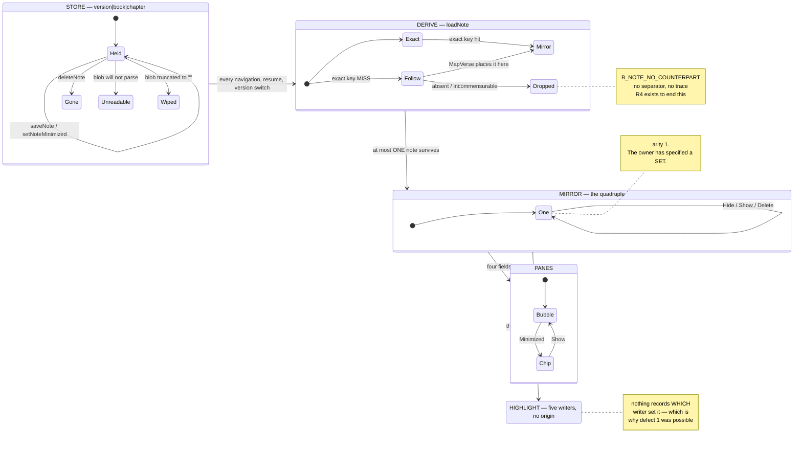

# The notes subsystem, as a state machine

> **Status.** Sections marked **[OBSERVED]** describe code that exists today,
> with `file:line`, and every behavioural claim in them was run against the real
> functions rather than read off the page. Sections marked **[INTENDED]**
> describe behaviour the owner has specified and the code does not have. Do not
> read an **[INTENDED]** paragraph as a description of the app.
>
> This document exists because in ONE DAY the notes subsystem produced five
> distinct defects and every one of them was found by accident:
>
> 1. A highlight left on screen with no note to explain it, after a version switch.
> 2. Delete that did not delete — the verb addressed the note by the translation
>    being READ while it was stored under another. The reader binned a message,
>    watched it go, and met it again on the next navigation.
> 3. A note silently swapped for a DIFFERENT one on a version change, because
>    `loadNote` checks the exact key before following, and nothing told the reader.
> 4. Hide reversed by a trailing section that never consulted `Minimized`.
> 5. A note DISPLAYED under a translation it is not STORED under — which is what
>    made 2 and 3 possible at all.
>
> Five in a day, none by design, is the signal the shared-link flow gave before
> `docs/NKJV_FLOW.md` — where enumerating the space found fifteen blocked states
> nobody had seen. This is deliberately the same shape.

## Why a state machine and not a checklist

The shared-link document's rule is about liveness: every state must offer a way
forward. Notes need a second rule, because a note is **somebody else's message
and it exists nowhere else** — no server holds a copy, nothing re-fetches it, and
the reader cannot tell a note they never had from one the app lost.

> **Every mark on the page must have a meaning the reader can reach, and every
> verb must reach the object the reader aimed it at.**

Both halves have been broken in shipped code. The first half is defect 1
(`ORPHAN_HL` below) and is **still live today** by a route nobody has walked —
see `X4` and `X10`. The second half was defects 2 and 4; those were fixed on
2026-08-15, and the fix made `X12` reachable in their place.

## The shape of the thing



The two narrow places are marked. `loadNote` returns `(SharedNote, bool)`
(`notes_store.go:165-171`) — **at most one note leaves the store per chapter**,
whatever the store holds. And the highlight is five independent writers into one
undiscriminated set of fields.

## State variables

### The store [OBSERVED]

| Variable | Values | How the code knows |
|---|---|---|
| readability | readable / **unreadable** / **wiped** | `readNotesChecked` (`notes_store.go:87-107`). Three answers collapsed into two: a parse failure returns `ok=false` (`:97-99`) and every writer stands down; the EMPTY STRING returns `ok=true` (`:92-95`) and is indistinguishable from a new reader. |
| entry validity | valid / junk | `:100-104` drops blank `Book`, `Chapter < 1`, blank `Text` on READ; `:142` again on write. |
| occupancy | 0 … `notesMax` (200) | `notesMax` (`:69`). `writeNotes` sorts by storage key and keeps the TAIL (`:126-129`), so which notes die is arbitrary and the comment at `:59-68` says so. |
| per-note `Minimized` | collapsed / open | `SharedNote.Minimized` (`:43`). **This is the only per-note UI state the store carries, and it is the one the SET model needs.** |
| per-note `Received` | unix seconds, 0 for pre-field notes | `:50`; breaks ties in the follow order (`:202-207`) and drives "newest first". |
| **the key** | `version\|book\|chapter` | `noteKey` (`:53-55`). **Not changing** (owner). Consequence: at most ONE note per translation per chapter — two people sending notes on the same chapter in the same translation still overwrite each other (`:15-19`). |

### The derive [OBSERVED]

| Variable | Values | How the code knows |
|---|---|---|
| placement | exact-key hit / followed / no counterpart | `loadNote` (`:165-171`) checks the exact key **unconditionally first**, then `noteFromAnotherTranslation` (`:191-248`). |
| `MapVerse` answer | `Exact` / `Moved` / `Absent` / `Incommensurable` / lands in another chapter | `:220-222`. The last three are `continue` — the note is not returned at all. |
| candidate order | newest first, version id breaking ties | `:202-207`. Deterministic on purpose; a map range would show a different note on different runs. |
| `notesFeatureOn` | on (default) / off | `notes_setting.go:35-41`, `:67`. A process-global preference, **not part of `AppState`** — so there is no per-state or per-version scoping of it, and no record of when it changed. |

### The mirror — the quadruple [OBSERVED]

`state.go:74-90`. Four independent fields standing in for one note:

| Field | Meaning | Written at |
|---|---|---|
| `ActiveNote` | the note's TEXT — also the "is there a note?" flag | `notes_store.go:292`, `:311`, `:317`, `:418`; `share_link_open.go:309`, `:315`; `notes_setting.go:258` |
| `NoteMinimized` | collapsed | the same list, plus `notes_store.go:393`, `:402` |
| `NoteVerseLo` | the note's anchor, kept apart from the highlight because Hide clears the highlight | the same list |
| `NoteVersionID` | **where it is STORED** — the only handle Hide and Delete have | `notes_store.go:295`, `:314`, `:320`, `:421` **and nowhere else** |

**Both partial writers were fixed on 2026-08-15** (`31bc97630`):
`share_link_open.go:319` and `clearLiveNote` (`notes_setting.go:263`) now write
all four. That closed `X1` and `X2` — a quadruple assigned in pieces is not one
value, and the pieces disagreeing is exactly what those two were.

**It did not close the class, and a ninth writer proves it.**
`dev_links_on.go:145` writes three of the four (`ActiveNote`, `NoteMinimized`,
`NoteVerseLo`, leaving `NoteVersionID`) and was added the same day as the commit
whose whole thesis is that the four are one value. It is `//go:build bibletextdev`
so it does not ship — but a convention that leaks into the tree on the day it is
written is not a convention, it is a hope. This is the argument for the type: one
value cannot be assigned in pieces if there are no pieces to assign.

### The highlight — and the variable nobody has written down [OBSERVED]

`state.go:65-69` carries `HasHighlightedVerse` / `HighlightedBook` /
`HighlightedChapter` / `HighlightedVerse` / `HighlightedVerseEnd`.

**Nothing records which of the writers set it.** There are five:

| Origin | Writer |
|---|---|
| a note | `notes_store.go:331-337`, and again on restore at `:404-410` |
| a search result, or a notes-browser row | `state.go:772-778` (`openSearchResultRange`) |
| the verse of the day, a cross-reference, the Go-to box | `verse_of_day.go:282-286` (`goToVerseRange`), reached from `verse_of_day.go:268` and `goto.go:577` |
| a shared link's verse span | `share_link_open.go:271-276` |
| read-along | **a different channel entirely** — see `READALONG` below |

And nothing records the **frame**: the highlight is a raw integer with no
translation attached, while the note beside it is renumbered by `MapVerse`.

Because origin is not recorded, `applyNoteForCurrentChapter` has to **infer** it
(`notes_store.go:307-310`):

```go
if state.ActiveNote != "" && state.NoteVerseLo > 0 &&
    state.HasHighlightedVerse && state.HighlightedVerse == state.NoteVerseLo {
    clearHighlightedVerse(state)
}
```

That is one comparison of a bare NUMBER standing in for "did this note put this
highlight here?", and it is wrong in **both directions**, both measured:

- **Under-clears.** A note on John 3:16 goes away while a search highlight sits
  on John 3:1 — `16 != 1`, the guard declines, and the reader is left with a lit
  verse and nothing to explain it. That is defect 1, one guard away from
  returning, and it is what `X4` reaches through a different door.
- **Over-clears.** A note on John 3:16 goes away while an unrelated highlight
  sits on **Genesis 1:16** — `16 == 16`, and the guard destroys a mark in a
  different book. The guard tests neither book nor chapter. Measured, but by
  setting the fields directly: no reader action demonstrated here produces a
  highlight whose book differs from the chapter being read, because every writer
  sets book, chapter and verse together and every navigation either clears or
  re-derives. So this direction is a **latent property of the guard, not a
  shipped defect** — recorded because the next writer to set `Has` without the
  location (see `GHOST_LOC`) would make it one.

One comparison, two opposite failures. That is what an inference standing in for
a missing fact does.

**Treat origin as a first-class state variable.** It is the single missing fact
that turns this inference into an equality.

### What the panes read [OBSERVED]

| Surface | Reads | At |
|---|---|---|
| Fyne banner (Windows / Linux / Android) | `ActiveNote`, `NoteMinimized`, current book/chapter | `notes_banner.go:37-88` |
| iOS sticker | `ActiveNote`, `NoteMinimized`, `NoteVerseLo` | `reading_ios.go:2107-2126`, pushed from `:2011` |
| macOS sticker | the same three | `reading_macos.go:1559-1578`, pushed from `:1482` |
| the render gate | `len(ActiveNote)` + `NoteMinimized` | `reading.go:487-495` |
| the tap menu's verbs | `gHasNote`, a **chapter-level bit** | `reading_ios.go:2005-2011`, consumed at `:274-292` |
| the browser | the whole store, unfiltered by translation | `notes_browse.go:184-190` |

## The states

Each is what a reader can actually be in. `[OBSERVED]` unless marked.

### Resting

**`BARE`** — notes on, store readable, nothing stored for this passage in any
translation, no highlight. `notes_store.go:298-315` falls to the not-ok branch
and blanks the quadruple.
*The reader sees:* the chapter, unmarked.

**`NOTE_OWN`** — exactly one note, stored under the translation being read,
expanded. `NoteVersionID == currentVersion().ID`. Exact-key hit at
`notes_store.go:167-169`, mirror set at `:317-320`, highlight at `:331-337`.
*The reader sees:* a bubble reading "Note from Friend" plus the reference, its
verse range tinted, and two verbs. Both verbs address `noteStoreVersion()`, which
here equals the reading version, so both reach the note.

**`NOTE_FOLLOWED`** — one note, stored under ANOTHER translation, found by
`noteFromAnotherTranslation` and renumbered by `MapVerse` into this one.
`VersionID` deliberately not rewritten (`notes_store.go:224-231`).
*The reader sees:* **chrome identical to `NOTE_OWN`.** Nothing says the note
belongs to another translation or that its verse numbers were mapped.
Indistinguishable by inspection. This is the state **R2** exists to end.

**`COLLAPSED`** — a note is present and `Minimized`. The mirror carries the note
and its anchor; the highlight is down, because `applyNoteForCurrentChapter`
returns before the highlight block (`notes_store.go:318`, `:321-323` — that
return IS the fix for defect 4).
*The reader sees:* a "Show note" chip (Windows / Linux / Android) or the
collapsed native button. **This state proves all-collapsed is already legal and
already honoured on navigation** — measured: Hide, then three navigations, still
collapsed.

### Masking

**`NOTE_MASKED`** — the chapter holds two or more notes across translations.
`loadNote` returns exactly one and the rest are invisible with no trace.
Measured: three notes on John 3 under `web` / `bsb` / `webc`; a WEB reader sees
the `web` one, an NKJV reader sees the `bsb` one, and the browser shows all three.
*The reader sees:* one bubble, which reads as "the note on this chapter". No
count, no separator. **The two surfaces disagree about how many notes exist on
the same passage.**

**`COLLAPSED_MASK`** — the exact-key note is `Minimized` while a DIFFERENT,
expanded note on the same passage exists under another translation. The exact key
wins **unconditionally, including when collapsed** (`notes_store.go:167-169`
returns before the follow path is reached). Measured: a WEB reader sees the
collapsed `web` note; delete it and the expanded `bsb` note appears.
*The reader sees:* a chip. Pressing it opens a note they may never have seen. The
only way to reach the masked note from the reading view is to **delete the one in
front of it**.

**`UNREACHABLE`** — a note exists for this passage but `MapVerse` answers
`Absent` or `Incommensurable`, or maps it into another chapter, so
`noteFromAnotherTranslation` skips it (`notes_store.go:221-222`). Measured: a
WEBC Greek-Esther note, read back under WEB, is not returned — and is still in
the store.
*The reader sees:* a bare chapter. No separator, no explanation, no trace.
Recorded as `B_NOTE_NO_COUNTERPART` in `docs/NKJV_FLOW.md:137`, an open violation
of I3. This is what **R4** exists to end.

### Highlight states

**`HL_ONLY`** — a highlight with no note, from any of the five writers.
*The reader sees:* a tinted verse. On iOS, tapping offers "Clear highlight"; on
desktop, Escape clears it. **Nothing on screen says why it is lit** — the
explanation lives entirely in the reader's memory of the tap that caused it.

**`ORPHAN_HL`** — the note is gone and its highlight is not, because the guard at
`notes_store.go:307-310` compares a single verse NUMBER. Measured both ways (see
"the variable nobody has written down").
*The reader sees:* a tinted verse and no message — exactly defect 1. On iOS the
tap menu may still offer "Hide note" and "Delete note" for it, because `gHasNote`
is a chapter-level bit (`reading_ios.go:2005-2011`, `:274-292`).

**`SPLIT`** — an expanded note whose bubble anchors at `NoteVerseLo` while the
tint sits elsewhere, because a highlight was already on this chapter when the
note was derived and the don't-clobber guard stood down
(`notes_store.go:327-330`). Pinned for the arrival case by
`notes_resume_test.go:100-115`.
*The reader sees:* two marks on one chapter with one explanation between them.

**`GHOST_LOC`** — `HighlightedBook` / `Chapter` / `Verse` populated while
`HasHighlightedVerse` is false. Two routes, both measured:
- `share_link_open.go:277-280` sets the flag false by hand instead of calling
  `clearHighlightedVerse`. Reachable when a note has just re-raised the highlight
  between `selectBook`'s clear (`:259`) and this branch — measured:
  `book=John chapter=3 verse=16 has=false`.
- `openSearchResultRange` (`state.go:772-778`) sets the three fields and then
  computes the flag from `verse.Verse > 0`. A **chapter-level note** has
  `VerseLo == 0`, so tapping one in the browser (`notes_browse.go:258`) lands here
  — measured: `book=John chapter=3 verse=0 has=false`.
*The reader sees:* nothing today; every consumer gates on `Has` first
(`isVerseHighlighted`, `state.go:828-838`). It is a loaded trap for the next
writer that sets `Has` without setting the rest.

**`HL_FRAME`** — the highlight survived a version switch as a raw integer in the
PREVIOUS translation's numbering. `applyLoadedVersion` (`versions.go:532-585`)
neither clears nor renumbers it, though `MapVerse` — the machine built for exactly
this — is applied to the note beside it. Measured: `MapVerse` says web
Romans 14:24 is bsb 16:25; after the switch the highlight is still `Romans 14:24`.
*The reader sees:* the wrong verse lit, or — where the new chapter is shorter, or
`clampToCurrentVersion` moved the book — nothing lit while `HasHighlightedVerse`
stays true. In that case Escape is consumed and appears to do nothing
(`ui_desktop.go:100-108`) and the iOS clear-highlight UI stays off
(`reading_ios.go:1364`). **Two marks, two rulers.**

**`READALONG`** — the SECOND highlight channel, outside `AppState` entirely:
per-platform narration tint with its own state (`reading_styled_readalong.go:47-79`,
plus the `styledHighlightCeded` latch at `:131`; `reading_ios.go:516-519`,
`reading_android.go:632-640`, `reading_macos.go:439-444`).
*The reader sees:* a moving tint that can coexist with a note's tint and a search
tint on the same chapter, drawn by a different mechanism and cleared by a
different rule. The fix for the two channels fighting is a **latch, not a model**.

### Verb states

**`COLLAPSED_STUCK`** — `COLLAPSED` where the note is FOLLOWED. Hide addresses
`noteStoreVersion()` (`notes_store.go:394`); Show addresses `currentVersion().ID`
(`:403`). The restore lands on a key that holds nothing and `setNoteMinimized`
returns in silence (`:267-270`). Measured: after Show, mirror `false`, **store
`true`**, and after the next navigation `true` again.
*The reader sees:* the note opens, looks normal, and collapses again on the next
navigation as though they had never touched it. A verb that appears to work and
does not.

**`NOTE_SUBSTITUTED`** — a version change (or a Delete) re-derives and `loadNote`
finds a different note. `versions.go:576-583` re-derives; `notes_store.go:165-171`
checks the exact key first and follows only on a miss. This is the mechanism of
defect 3 and it is still live.
*The reader sees:* the bubble's text changes under their hand, with no notice.
**The reader cannot tell a swap from an edit.**

### Degraded store

**`UNREADABLE`** — the blob does not parse; every mutating verb stands down and
leaves the bytes alone (`notes_store.go:96-99`, `:145-148`, `:252-255`,
`:262-265`). Measured: `entries=0 ok=false`.
*The reader sees:* no notes anywhere. Settings reads 0 and "Delete all notes" is
disabled (`ai_settings.go:532-540`). **Nothing distinguishes this from having no
notes.** The design decision is right — refusing to write is what saves the
collection — but the reader is never told the app cannot read it.

**`WIPED`** — the store presents as the EMPTY STRING, which `readNotesChecked`
treats as "genuinely empty, and safe to write to" (`notes_store.go:92-95`). The
Fyne `os.Create` preferences truncation recorded in the 1.1.8 pre-release
findings presents exactly this way. Measured: `entries=0 ok=true`.
*The reader sees:* a reader who had forty messages now has none, and the app
reports the state of a brand-new reader. **The one guard built to prevent total
silent loss cannot see this case at all.**

**`JUNK_PURGED`** — an entry violating the validity filter is dropped on READ and
then permanently destroyed by the next unrelated write, because every mutation
rewrites the whole blob from the filtered map (`notes_store.go:100-104`, `:142`,
`:116-135`). Measured: a 3-entry blob became 1 entry after an unrelated minimize.
*The reader sees:* nothing, ever. Named because it is the trap for any future
atomic-sidecar fix to `WIPED`.

### Feature off, and links

**`OFF`** — `notesFeatureOn` is false. The store is untouched;
`applyNoteForCurrentChapter` blanks the mirror and returns before any store read
(`notes_store.go:288-297`).
*The reader sees:* no bubble, no chip, no "Share with note" in the selection menu
(`reading_ios.go:179`, `reading_macos.go:134`), no Notes mode. A shared link still
opens the passage. Everything comes back on switching it on.

**`OFF_STUCK`** — the feature was just turned off and the reader chose "Keep
them". That path runs `setNotesEnabled(false)` + `state.refresh()` and clears
nothing (`ai_settings.go:498-501`); only the DELETE path calls `clearLiveNote`
(`notes_setting.go:129-136`). The native stickers push `state.ActiveNote` with
**no feature gate** (`reading_ios.go:2107-2126`,
`reading_macos.go:1559-1578` — the gate at `reading_macos.go:1475-1478` covers
only the "Share with note" menu item); the Fyne banner IS gated
(`notes_banner.go:38`).
*The reader sees:* platform-divergent. On Windows, Linux and Android the bubble
goes at once. On iOS and macOS the sticker keeps drawing the note until the next
navigation re-derives — and because the render fingerprint (`reading.go:487-495`)
is computed from `ActiveNote`, which has not changed, the pane may not repaint at
all.

**`OFFER`** — a link carrying a note arrives while notes are off. Measured:
nothing mutates — no navigation, no store write, no mirror change
(`share_link_open.go:62-65`, `:83-86`; `notes_offer.go:121-132`).
*The reader sees:* a card with three ways out — read it in the browser (which for
`/nkjv/` is a live 404, `B_NOTE_OFFER_404`, and drops the note), just the passage
(the note is dropped, not stored), or turn notes back on and read it here (the
only branch that keeps it).

**`PARKED`** — a link is held because the data is not ready, the translation is
loading, or the book is not in the four-book seed. The note lives ONLY in
`pendingLink` — not in the store, not in the mirror; `rememberIncomingNote` runs
only inside `applyShareTarget` (`share_link_open.go:312`).
*The reader sees:* a notice card naming the passage. **The note is one process
death away from never having existed.**

### The browser

**`BROWSER`** — Notes mode on the Search tab: every stored note regardless of
translation, sorted newest-first or in Bible order, filtered live
(`notes_browse.go:184-190`, `:264-349`, `:390-424`).
*The reader sees:* a list of cards — reference in accent bold, a date, the note's
text as a plain wrapped label, and "Minimized in the chapter" where it applies.
The text is **not** in a bubble and the translation it is stored under is **not**
named. Those are the two things the owner's directive changes.

**`DEADTAP`** — a browser row whose book is absent from the canon now loaded (a
WEBC deuterocanon note read back under WEB). `openNote` returns rather than
stranding the reader on a blank pane (`notes_browse.go:250-257`). Measured: the
tap leaves the reader on John 3 and the row stays in the list.
*The reader sees:* nothing at all. The tap is swallowed with no message. Correct
in what it refuses to do and silent about refusing — a blocked state by
`docs/NKJV_FLOW.md`'s own rule.

### Intended

**`I_ATTR`** — **[INTENDED — R2]** every note names the translation it is stored
under, wherever it is drawn. Derived from the store key's `VersionID`, which the
model already carries and which today only the verbs consult.
*The reader would see:* an attribution line naming the sender AND the
translation, so `NOTE_OWN` and `NOTE_FOLLOWED` become distinguishable and a
renumbered verse range is explained rather than merely correct.

**`I_ELSEWHERE`** — **[INTENDED — R4]** notes with no home in this translation
appear below a separator with a sentence saying why. Falls out of turning the
reject gate at `notes_store.go:221-222` from a `continue` into an append with
`Placed = false`. Closes `B_NOTE_NO_COUNTERPART` and satisfies I3.
*The reader would see:* the placeable notes in the text, then a rule, then "Also
on this passage, from a translation whose numbering does not line up", then the
note, tappable.

**`I_SET_NONE`** — **[INTENDED]** a chapter holds several notes, every one
collapsed. **The owner has ruled this legal**: an explicit minimize must be
honoured and nothing may auto-expand. Today's quadruple cannot say it — "no note"
and "notes present, all collapsed" both present as a text-empty mirror to
anything that has not also read the store. Measured: with two collapsed notes on
John 3 the mirror carries one of them and the second is nowhere in `AppState`.
*The reader would see:* a row of placeholder bubbles, no expanded body, no tint.

**`I_SET_ONE`** — **[INTENDED]** several notes, exactly one expanded; expanding
another collapses the first. **The cap is TEMPORARY.** Today's store cannot even
represent it — measured: three notes on John 3, all `Minimized=false` at rest,
with nothing able to enforce a cap.
*The reader would see:* one open bubble, the rest as placeholder chips.

**`I_BROWSER_BUBBLE`** — **[INTENDED]** the browser renders note text in the
READING VIEW'S bubble, with the version label OUTSIDE it (owner directive).
Requires one shared bubble builder, which is also what stops the two surfaces
drifting the way they do today.

## Transitions

Reading the table: the **verb** is what the reader does; the **lands in** column
is where they end up **today**.

| From | Verb / event | Code | Lands in |
|---|---|---|---|
| any | navigate | `state.go:514` → `applyNoteForCurrentChapter` | re-derived from the store |
| any | resume from background | `app.go:213` → `applyNoteOnResume` (`notes_store.go:450-455`) | re-derived |
| any | switch translation | `versions.go:576-583` | re-derived — **note renumbered, highlight NOT** → `HL_FRAME` |
| any | shared link arrives | `share_link_open.go:302-318` | mirror overwritten **by hand**, `NoteVersionID` untouched → `X1`, `X2` |
| `NOTE_OWN` | Hide | `notes_store.go:389-396` | `COLLAPSED` |
| `NOTE_FOLLOWED` | Hide | same, key = `noteStoreVersion()` | `COLLAPSED` |
| `COLLAPSED` (own) | Show | `notes_store.go:398-411` | `NOTE_OWN` |
| `COLLAPSED` (followed) | Show | same, key = `currentVersion().ID` | **`COLLAPSED_STUCK`** — store never changed |
| `NOTE_OWN` | Delete | `notes_store.go:413-423` | `BARE`, or **`NOTE_SUBSTITUTED`** on the next navigation if another translation holds one |
| after a link over a followed note | Delete | `noteStoreVersion()` is stale | **`X1`** — the wrong note dies |
| `NOTE_*` | notes switched off, "Keep them" | `ai_settings.go:498-501` | **`OFF_STUCK`** + **`X4`** (the highlight survives) |
| `NOTE_*` | notes switched off, "Delete them" | `notes_setting.go:129-137` | `OFF`, mirror and highlight cleared |
| `BROWSER` | tap a row | `notes_browse.go:230-259` | the note's translation, un-minimized, at the passage — or `DEADTAP` |
| `BROWSER` | tap a chapter-level note | `notes_browse.go:258` → `state.go:772-778` | `GHOST_LOC` |
| store at 200 | a link arrives | `notes_store.go:126-129` | **`X3`** — stored and evicted by the same write |

## Invariants

These are what `notes_state_flow_test.go` enforces. A change that breaks one is a
regression even if every existing test stays green. They extend, and do not
replace, I1–I6 in `docs/NKJV_FLOW.md`.

- **N1 — No mark without a meaning, and no mark destroyed that had one.** A
  highlight on screen must have something on screen that explains it; and a mark
  put there by somebody else's action must survive a verb aimed at the note.
  *Violated by `ORPHAN_HL`, `X4`, `X10`.*
- **N2 — A verb reaches what the reader aimed it at.** Hide, Show and Delete must
  address the note whose text is on screen, and no other. *Violated by `X1`,
  `X2`, `X5`.*
- **N3 — No silent substitution.** The text in the bubble must not change to a
  different note's without something saying so. *Violated by `X6`,
  `NOTE_SUBSTITUTED`.*
- **N4 — Nothing in the store is invisible from the reading view.** *Violated by
  `X7` (`NOTE_MASKED`, `COLLAPSED_MASK`) and by `UNREACHABLE`.* This is I3
  restated for the store rather than for the link.
- **N5 — An explicit minimize is honoured, and nothing auto-expands.** All
  collapsed is a legal resting state. *Held today for the own-key case; violated
  by `X2` and `COLLAPSED_STUCK`/`X5`.*
- **N6 — The mirror agrees with the store.** A note on screen is a note in the
  store, under the key the verbs will address. *Violated by `X3`.*
- **N7 — One ruler.** Every verse number in `AppState` is in the numbering of the
  translation being read. *Violated by `X11`/`HL_FRAME`.* `MapVerse` is applied to
  the note and not to the highlight.
- **N8 — At most one expanded** *(temporary, [INTENDED])*. Not representable
  today; see the rework.

## Incoherent states

Every one below was reached by driving the real functions. `exists today` means
the probe produced it from the shipping code.

| # | Name | Exists today | Cells that reach it | What it costs the reader |
|---|---|---|---|---|
| ~~X1~~ | ~~Delete kills the wrong note~~ | **FIXED** `31bc97630` | 0 | — |
| ~~X2~~ | ~~Hide is a silent no-op~~ | **FIXED** `31bc97630` | 0 | — |
| **X12** | **Delete the arriving note, the followed one takes its place** | **yes** | 4 | The message the reader binned is replaced by a stranger's, unannounced |
| **X3** | Arriving note evicted by its own save | **yes** | pinned separately | The note is shown and was never stored |
| **X4** | Notes-off orphans the highlight | **yes** | 11 + 1 | Defect 1, through the control whose job is to make notes stop |
| **X5** | Hide/Show asymmetry | **yes** | 4 | Show appears to work and does not |
| **X6** | Delete substitutes a different note | **yes** | 8 | A stranger's message appears where the deleted one was |
| **X7** | More than one note on a passage is invisible | **yes** | 48 | The only way to the second note is to delete the first |
| **X8** | Bare link strips a note's highlight | **yes** | pinned separately | An expanded note pointing at nothing |
| **X9** | Chapter-level note leaves a ghost location | **yes** | pinned separately | Nothing today; a trap for the next writer |
| **X10** | Hide and Delete destroy a mark they do not own | **yes** | 28 + 3 | The search result the reader was holding vanishes when they tidy a note away |
| **X11** | The highlight keeps the previous translation's numbering | **yes** | 3 | The wrong verse lit, or none, beside a note that WAS renumbered |

"Cells" is how many combinations of the enumerated variables reach it. `X7`'s 48
and `X10`'s 28 are not 48 and 28 defects — they are one defect each, reachable
from that much of the space, which is the measure of how hard it is to avoid.

### X1 and X2 — FIXED 2026-08-15 (`31bc97630`)

Delete and Hide both addressed the note `NoteVersionID` named, and the arrival
path left that field pointing at the PREVIOUS note — so a reader who binned the
message in front of them destroyed a different one, silently, and a reader who
hid one collapsed another. `share_link_open.go:319` and `notes_setting.go:263`
now write all four fields, and the enumeration reports both defects covering
zero cells.

**Read `X12` before recording this as 18 violations removed.** Fourteen were.
The other four are still there under a new name: a Delete that misses cannot
expose the note standing behind it, so fixing the verb made the substitution
reachable in the region these two used to occupy. The subsystem has now produced
a defect out of the fix for the previous defect five times running, which is the
argument for the rework rather than a sixth patch.


### X3 — Arriving note evicted by its own save

**How it is reached.** The store holds `notesMax` notes. A link arrives.
`rememberIncomingNote` saves it; `writeNotes` (`notes_store.go:116-135`) sorts by
storage key and keeps the TAIL, so any key sorting below the 200 survivors is
discarded **on the very write that stored it**. `applyShareTarget` has already set
`ActiveNote` from `t.Note`, so the reader sees it.

**Why it is wrong.** I3 says a note is never silently dropped. This drops it at
the moment of arrival, shows it anyway, and loses it on the next navigation with
no message. `"bsb|…"` sorts below every `"web|…"`, so which notes are destroyed
depends on nothing a reader can perceive. Hide and Delete then address a key that
no longer exists and return in silence.

**Evidence.** 200 stored; link arrives; "the arriving note was NEVER STORED
(evicted by its own write)"; next navigation `note=""`.

### X4 — Notes-off orphans the highlight

**How it is reached.** A note with a verse span is on screen. The reader turns
shared notes off and answers "Keep them". `ai_settings.go:498-501` runs
`setNotesEnabled(false)` + `state.refresh()` and nothing else.

**Why it is wrong.** The banner hides (`notes_banner.go:38`) but the highlight the
note placed is untouched, and the off-branch of `applyNoteForCurrentChapter`
(`notes_store.go:291-297`) blanks the mirror and **returns before the
clear-guard**, so the next re-derive cannot rescue it either. This is defect 1,
reachable through the one control whose entire purpose is to make notes stop.

**Evidence.** After the switch: `note="hold on" highlight=true v=16` (stale
mirror). After the next re-derive: `note="" highlight=true v=16`.

### X5 — Hide/Show asymmetry

**How it is reached.** A followed note (stored under BSB, read in the WEB). Hide,
then Show.

**Why it is wrong.** `hideCurrentNote` addresses `noteStoreVersion()`
(`notes_store.go:394`); `restoreCurrentNote` addresses `currentVersion().ID`
(`:403`). The restore lands on an empty key and returns in silence. **The two
verbs of one pair do not address the same object.**

**Evidence.** After Show: mirror `minimized=false`, **STORE `minimized=true`**;
after the next navigation `minimized=true`.

### X6 — Delete substitutes a different note

**How it is reached.** Two notes on one passage, one under WEB and one under BSB.
Read in the WEB, the exact key wins. Delete it.

**Why it is wrong.** The pane goes blank, then on the next navigation a DIFFERENT
person's note appears in the same place, because `loadNote` falls through to
`noteFromAnotherTranslation`. This is defect 3's mechanism reached by the Delete
verb rather than by a version switch. `dropCurrentNote` does not re-derive, so
the swap is invisible until the reader has moved on and come back.

**Evidence.** Showing `"note A (web)"`; after Delete `""`; after the next
navigation `"note B (bsb)"`.

### X12 — Delete the arriving note, and the followed one takes its place

**How it is reached.** A note is stored on John 3 under BSB. A friend sends a WEB
link with a note on the same chapter; the reader is in the WEB, so the arriving
note wins on the exact key. The reader deletes it.

**Why it is wrong.** `deleteNote` now removes exactly the right entry — that is
`X1`'s fix working. But `loadNote` (`notes_store.go:165-171`) falls through to
`noteFromAnotherTranslation`, so on the next navigation the BSB note is standing
there instead, in the same bubble, with nothing to say it is a different person's
message. `dropCurrentNote` does not re-derive, so the reader does not see the
swap until they have moved on and come back.

**This is `X6`'s mechanism, not a new one.** `X6` reaches it by deleting the
exact-key note when both exist; `X12` reaches it by deleting an ARRIVING note,
which only became possible once Delete started working. It is pinned separately
because the two are reached by different routes and because the date matters: it
records that fixing a verb in this subsystem exposed a defect behind it, which is
the fifth time in a row that has happened.

**Not a regression.** Before the fix the reader lost a message they were not
looking at. Now they lose the one they aimed at and are handed another without
being told. The second is strictly better and still wrong, and only the arity-1
read — one note leaving the store per chapter — closes it.

**Evidence.** Enumeration at `31bc97630`: 4 cells, `N3-substituted`,
`place=followed arrival=true verb=delete`, across both `collapsed` and
both `foreignHL` values.

### X7 — More than one note on a passage is invisible

**How it is reached.** Any chapter holding notes under two translations — two
people sharing links from different translations, or a note the reader already
had plus one that arrives on a link.

**Why it is wrong.** `loadNote` returns one note and the rest have no trace: no
count, no separator, nothing. The sharpest form is a **minimized** exact-key note
masking a **live** one, because `loadNote` returns on the exact key
**unconditionally, including when it is collapsed** (`notes_store.go:167-169`) —
so the reader sees a chip, and the only way to reach the note behind it from the
reading view is to delete the one in front. Meanwhile the browser lists both, so
the two surfaces disagree about how many messages the reader has.

**Evidence.** Reached from **48** cells — every combination where the passage
holds more than one note. Directly: the reader sees `note="collapsed web note"
minimized=true`; deleting it reveals `"EXPANDED bsb note"`. And with three notes
on John 3 under `web` / `bsb` / `webc`, the chapter shows one and the browser
shows three.

### X8 — Bare link strips a note's highlight

**How it is reached.** A chapter-level shared link (no verse) to a chapter that
already carries a note with a verse span. `applyShareTarget`'s highlight block
runs at `share_link_open.go:271-280`, AFTER `addRecentChapter` has installed the
note's highlight and BEFORE the note block at `:302-318`.

**Why it is wrong.** `t.VerseLo == 0` takes the else arm, which sets
`HasHighlightedVerse = false` by hand. The note survives (the `:308` guard was
added for exactly that) but its tint does not, so an expanded note points at
nothing.

**Evidence.** Before: `note="look at 16" highlight=true v=16`. After:
`note="look at 16" highlight=false`, with `HighlightedBook="John"`,
`HighlightedChapter=3`, `HighlightedVerse=16` still set — which is also `X9`.

### X9 — Chapter-level note leaves a ghost location

**How it is reached.** Two routes, both above under `GHOST_LOC`.

**Why it is wrong.** It is inert today only because every consumer gates on
`HasHighlightedVerse` first. It is a state the model permits and the code does not
mean, which is the definition of a trap.

**Evidence.** Route A `has=false book="John" chapter=3 verse=16`; route B
`has=false book="John" chapter=3 verse=0`.

### X10 — Hide and Delete destroy a mark they do not own

**How it is reached.** The reader searches, lands on John 3:1, and a note bubble
is sitting on John 3:16 in the same chapter. They tidy the note away — Hide or
Delete. Their search highlight goes with it.

**Why it is wrong.** The derive goes out of its way NOT to clobber a highlight
that is on the chapter for another reason — that is the whole point of
`notes_store.go:327-330`, and the comment there says so: *"That highlight is what
the reader just asked for; the note's is only a default."* Both verbs then call
`clearHighlightedVerse` **unconditionally** (`:395` for Hide, `:422` for Delete),
which throws away exactly the highlight the derive protected. The care taken in
one function is undone two functions later, and neither can see the other because
neither knows where the mark came from.

**Evidence.** Reached from **28** cells of the notes enumeration and **3** of the
origin enumeration — every combination where a foreign mark is present and the
verb is Hide or Delete. Directly: before, `note="a note on 16" highlight=true
v=1`; after Hide, `note="a note on 16" highlight=false v=0`.

### X11 — The highlight keeps the previous translation's numbering

**How it is reached.** A highlight from a search, the verse of the day or a link
span sits on WEB Romans 14:24. The reader switches to the BSB.

**Why it is wrong.** `MapVerse` says that verse is BSB **16:25** — the doxology,
the divergence `share_link_open.go:108-111` documents by measurement. The note on
the same passage IS renumbered (`notes_store.go:213-215`); the highlight is not,
because `applyLoadedVersion` (`versions.go:532-585`) neither clears nor maps it,
and because there is no field saying which numbering it is in. **Two marks, two
rulers.** Where the new chapter is shorter, nothing lights at all while
`HasHighlightedVerse` stays true — and then Escape is consumed doing nothing
(`ui_desktop.go:100-108`) and the iOS clear-highlight control is not attached
(`reading_ios.go:1364`), so the reader cannot even take it down.

**Evidence.** `MapVerse says web Romans 14:24 is bsb 16:25 (moved)`; after the
switch the highlight is still `Romans 14:24`. Reached from all three foreign
origins in the origin enumeration.

## REWORK — the straight answer

**Yes.** Not on taste, and not because the code is untidy — it is unusually well
commented and most of these guards were written by someone who had already been
bitten. The model is what is wrong, in three specific ways, and each one is
measurable rather than aesthetic.

### 1. The arity is wrong, and no guard can fix an arity

`AppState` models exactly ONE note (`state.go:74-90`). The owner has specified a
SET:

> "All notes should be able to be viewed at the same time, but for now, we can
> have only one expanded at a time with the other being the placeholder bubbles."
>
> "When I say one expanded at a time that may also include all notes minimized!
> … But we will want to change this probably in the future so think ahead."

`loadNote` returns `(SharedNote, bool)`. Everything downstream — the mirror, the
banner, both native stickers, the render fingerprint — is shaped by that
signature. `NOTE_MASKED`, `COLLAPSED_MASK` and `X7` are not three bugs; they are
one cardinality mismatch seen from three angles, and the browser showing three
notes while the chapter shows one is the same mismatch again.

### 2. The four fields are not one value, so they can disagree

Seven writers, **two of which do not write all four** (`share_link_open.go:308-313`
writes three; `notes_setting.go:254-262` clears three). `X1` and `X2` are exactly
that tear: the screen shows the `web` note while `NoteVersionID` still says
`bsb`, and both verbs follow the field rather than the screen.

### 3. The note's identity is reconstructed rather than carried

A note's identity is its storage key. The mirror carries a **copy of its fields**,
and `noteStoreVersion()` (`notes_store.go:379-387`) rebuilds one third of the key
while the caller supplies the other two thirds from *the reader's current
location*. That is why Hide and Show address different keys (`X5`): one asks the
mirror, the other asks where the reader happens to be.

### And, independently: the highlight has no origin and no frame

Five writers, no discriminant, so ownership is inferred from a bare number that is
wrong in both directions (`ORPHAN_HL`, `X10`); and no version field, so `MapVerse`
is applied to the note and not to the highlight beside it (`HL_FRAME`).

### What replaces the quadruple

Two types and one field. The store is untouched.

```go
// NoteKey is a note's IDENTITY — the key it is stored under. Never derived,
// never reconstructed from where the reader happens to be: carrying it is what
// makes X1, X2 and X5 unrepresentable rather than merely guarded.
type NoteKey struct {
	VersionID string
	Book      string
	Chapter   int
}

// ChapterNote is one note as the panes need it: identity, words, and a location
// already renumbered into the translation being READ.
type ChapterNote struct {
	StoreKey  NoteKey // what Hide and Delete address
	Text      string
	VerseLo   int  // MapVerse'd into the reading translation
	VerseHi   int
	Placed    bool // false: no counterpart here — R4's "elsewhere" group
	Collapsed bool // mirrors SharedNote.Minimized, per note
	Received  int64
}
```

and in `AppState`, replacing all four fields:

```go
// Every note on the passage being read, in a stable order. Empty is BARE;
// non-empty with every Collapsed is I_SET_NONE, and the two are now different
// states rather than the same zero.
ChapterNotes []ChapterNote
```

**There is deliberately no `ExpandedNote` field.** `Collapsed` is per-note and is
the truth; "at most one expanded" is a **policy over that truth**, not a shape.
That is what makes lifting the cap a one-line change instead of a migration.

### Where the temporary cap lives — the single place to lift it

One function, and it is the only thing in the tree that knows the number:

```go
// expandNote opens one note and is the ONLY policy about how many may be open.
//
// TEMPORARY (owner, 2026-08): at most one expanded at a time. Zero expanded is
// LEGAL — an explicit minimize must be honoured and nothing may auto-expand.
//
// TO LIFT THE CAP: delete the loop. Nothing else changes — not the store, not
// ChapterNote, not the panes, which already draw a set.
func expandNote(state *AppState, k NoteKey) {
	for i := range state.ChapterNotes {
		if state.ChapterNotes[i].StoreKey != k {
			state.ChapterNotes[i].Collapsed = true // ← the cap, and all of it
		}
	}
	setCollapsed(state, k, false)
}
```

`collapseNote(state, k)` is its unconditional twin and needs no policy: collapsing
is always allowed, and collapsing the last open note is a legal resting state.

### The highlight

```go
type highlightOrigin int

const (
	hlNone highlightOrigin = iota
	hlNote
	hlSearch      // openSearchResultRange, and the notes browser through it
	hlVerseOfDay  // goToVerseRange: verse of the day, cross-reference, Go-to
	hlLinkSpan    // a shared link's verse range
)

type Highlight struct {
	Book      string
	Chapter   int
	Verse     int
	VerseEnd  int
	VersionID string          // THE FRAME. What MapVerse needs on a switch.
	Origin    highlightOrigin // what the clear-guard has been inferring
	NoteKey   NoteKey         // set only when Origin == hlNote
}
```

With `Origin` recorded, `notes_store.go:307-310` becomes
`if hl.Origin == hlNote && hl.NoteKey == departing.StoreKey` — an equality on a
fact, not a coincidence on a number — and both `ORPHAN_HL` and `X10` become
unreachable. With `VersionID` recorded, `applyLoadedVersion` can do to the
highlight what it already does to the note, and `HL_FRAME` closes.

Read-along stays where it is. It is a genuinely separate channel with its own
lifecycle (`reading_styled_readalong.go:47-79`) and folding it in would buy
nothing; the cede latch at `:131` is the right shape for two channels.

### The six derive sites, and what happens to each

| # | Site | Today | After |
|---|---|---|---|
| 1 | `notes_store.go:298` — `applyNoteForCurrentChapter` | `loadNote` → one note | `chapterNotes()` → the whole set, `Placed` set per note. **The one real rewrite.** |
| 2 | `notes_store.go:404` — `restoreCurrentNote` | re-reads the store to recover the highlight | **deleted.** The note is in hand and carries its own range. |
| 3 | `state.go:514` — `addRecentChapter` | calls (1) | unchanged call, new body |
| 4 | `versions.go:581` — `applyLoadedVersion` | calls (1) | unchanged call, **plus** renumber-or-clear the highlight through its new `VersionID` — the `HL_FRAME` fix, and it belongs here because this is the only place a frame changes |
| 5 | `notes_store.go:454` — `applyNoteOnResume` ← `app.go:213` | calls (1) | unchanged |
| 6 | `share_link_open.go:308-313` — the link's own note | writes the mirror BY HAND, three fields of four | `rememberIncomingNote`, then call (1), then `expandNote(state, arrivingKey)`. **This single change closes X1 and X2**, because there is no longer a hand-written mirror to tear. |

Only sites 1 and 6 change shape. Four are call-sites that keep their signature.

### What the store keeps — and the one thing this does not fix

`version|book|chapter`, unchanged, as the owner said. Everything above works
against the existing blob and needs no migration: `SharedNote.Minimized` already
carries per-note collapsed state, and `Received` already gives the set a stable
order.

**But state it plainly:** that key means at most ONE note per translation per
chapter, and `saveNote` (`notes_store.go:160`) replaces on collision. Two people
sending notes on John 3 **in the same translation** still overwrite each other,
silently, and the SET model does not change that — it makes the reading view able
to show many, and the store can supply at most one per translation. The file
header (`notes_store.go:15-19`) chose this deliberately and the reasoning was
sound when a chapter showed one bubble. Once a chapter shows a set, that
reasoning expires. **Widening the key is a separate decision and is out of scope
here** — but it is the next thing that will force one, and it should not be
discovered during the SET work.

### How the panes ask for what they draw

One accessor replaces four fields.

| Surface | Today | After |
|---|---|---|
| Fyne banner | `ActiveNote` / `NoteMinimized`, `notes_banner.go:37-88` | `state.placedNotes()` → a column: the expanded one as a bubble, the rest as chips |
| iOS sticker | `bibleTextSetNote(text, min, verse, …)`, `reading_ios.go:2107-2126` | the same C entry point per note, in a loop, or (phase 1) the expanded one plus a collapsed COUNT for the placeholder bubbles — the C side already takes exactly `(text, min, verse)` |
| macOS sticker | `reading_macos.go:1559-1578` | the same |
| render gate | `len(ActiveNote)` + `NoteMinimized`, `reading.go:487-495` | fold the set: count, the expanded key, and the collapsed count. **Must change with the model or an expand/collapse of any member will not repaint** — the fingerprint is the reason "Delete note" once did nothing visible. |
| tap menu | `gHasNote`, a chapter-level BIT, `reading_ios.go:2005-2011` | the tapped verse's note key, so the verbs address the note under the finger instead of "the chapter's note" |
| browser | its own row layout, `notes_browse.go:390-424` | the SAME bubble builder as the reading view, with the version label outside it **[INTENDED, owner directive]** — one builder is what stops the two surfaces disagreeing |

### Recommended order, and what not to do

Two independent pieces. **Do the highlight first** — it is smaller, it needs no UI
change, and it closes the oldest defect:

1. **Highlight origin + frame.** Adds `Origin`, `NoteKey` and `VersionID`; changes
   five writers and one guard, and folds the five location fields into one struct
   so `GHOST_LOC` cannot be written. Closes `ORPHAN_HL`, `X4`, `X8`, `X9`, `X10`
   and `X11` — **46 of the 110 violations** — and makes `SPLIT` expressible
   instead of accidental. No UI change at all.
2. **The note set.** Adds `ChapterNote` / `NoteKey`, rewrites sites 1 and 6,
   re-points three verbs at a key they are handed. Closes `X1`, `X2`, `X5`, `X6`
   and `X7` — **64 of the 110**, counting `X12` — and makes `I_ATTR` (R2) and `I_ELSEWHERE` (R4)
   fall out rather than be added.

Three things are **not** fixed by either and must not be assumed away:

- **`X3` (eviction).** A capacity problem in `writeNotes`, orthogonal to the
  model. It needs its own decision about what to drop.
- **`WIPED`.** `readNotesChecked` cannot distinguish an empty store from a
  truncated one; nothing in the rework changes that, and `JUNK_PURGED` is the
  trap waiting for whoever fixes it.
- **`UNREADABLE` is silent.** Standing down is right; never saying so is not.

## What the test proves, and what it cannot

`notes_state_flow_test.go` walks two cross-products, driving the real
`saveNote`, `applyNoteForCurrentChapter`, `applyShareTarget`, `hideCurrentNote`,
`restoreCurrentNote`, `dropCurrentNote`, `openNote`, `goToVerseRange`,
`openSearchResultRange`, `applyLoadedVersion` and `addRecentChapter`.

- **The notes space** — feature on/off × placement (none / own / followed / both)
  × collapsed × a foreign highlight already present × a note-bearing link
  arriving × verb (none / Hide / Show / Delete / turn notes off) = **320 states**,
  of which 140 are skipped because the surface offers no such verb there (the
  banner's Hide and Delete exist only when a note is on screen,
  `notes_banner.go:38`; the iOS pair is gated on `gHasNote`,
  `reading_ios.go:2005-2011`; and a note-bearing link with notes off never reaches
  `applyShareTarget` at all, `share_link_open.go:62-65`). Asserts N1–N6.
- **The highlight-origin space** — origin (nothing / note / search / verse-of-day
  / link span) × event (navigate / delete the note / turn notes off / switch
  translation) = **20 states**. Asserts N1 and N7, on Romans 14 because that is
  where the numbering actually diverges.

Together they find **110 violations**, and every one is attributed to a named
defect: `X4`×12, `X5`×4, `X6`×8, `X7`×48, `X10`×31, `X11`×3, `X12`×4.

> **Re-measured 2026-08-15 against `31bc97630`.** This document first recorded
> 124 violations across eight defects. `X1`×8 and `X2`×10 are **fixed** and
> struck; `X12`×4 is new. The harness enforces both halves of that — a defect
> covering nothing fails as FIXED, so these totals cannot quietly go stale
> again. Read §"X12" before treating the drop as pure progress: 14 of the 18
> went away, and 4 came back wearing a different name.

The second enumeration is only possible because **the harness records an origin
the app does not**. That is not a harness convenience; it is the finding. A test
that has to carry a variable the production model lacks is telling you the model
lacks it.

The assertion is **set EQUALITY**, in both directions, exactly as
`share_link_flow_test.go` does it — a violation no pinned defect covers fails as
a NEW incoherent state, and a pinned defect that covers nothing fails as a FIXED
one until it is struck off here and in `knownIncoherent`. Violations are
attributed by predicate rather than pinned as 110 opaque strings, because 110
strings would bury the fact that they are eight defects and would let a genuinely
new violation hide among a hundred that look the same.

**What it cannot reach.** The panes. Everything above lives in `AppState` and the
store; whether iOS's sticker actually stops drawing after `X4`, or whether the
render fingerprint suppresses a repaint, is native code behind cgo and is asserted
here by inspection with `file:line`. `X3` needs the store at `notesMax`, `X8` and
`X9` need a link with no verse, and the frame case needs two chapters of Romans —
all four are pinned as named single-state tests rather than as cross-product
cells, because carrying three more axes to reach them would say nothing new about
the other 320. `UNREADABLE`, `WIPED` and `JUNK_PURGED` are store-shape states
covered by `notes_store_guard_test.go`, not by this enumeration.

## What a future change must not break

- **`NoteVersionID` is an ADDRESS, not a label.** It is the only handle Hide and
  Delete have. Every writer of the mirror must write it or the verbs address the
  previous note — which is `X1`, and which is what happened to
  `share_link_open.go:308-313`.
- **`loadNote`'s exact-key branch returns before the follow path, including for a
  collapsed note** (`notes_store.go:167-169`). That is `COLLAPSED_MASK`. Any
  change that makes the follow path run first swaps one masking for another; the
  answer is the set, not a different precedence.
- **`readNotesChecked`'s `ok=false` is what saves the collection**
  (`notes_store.go:87-107`). Never make a failed read answer "no notes" — a
  read-modify-write would then serialise that emptiness over everything the
  reader has.
- **Every mutation rewrites the whole blob from the filtered map**
  (`:100-104`, `:116-135`). Anything the filter drops on read is destroyed by the
  next unrelated write. A sidecar or an atomic-write fix must reckon with that
  before it moves any bytes.
- **The render fingerprint is part of the model, not an optimisation**
  (`reading.go:487-495`). It already folds in the note because without it
  "Delete note" did nothing visible. A set-shaped model with a scalar fingerprint
  reintroduces exactly that bug.
- **The highlight has two channels.** `AppState`'s and read-along's
  (`reading_styled_readalong.go:47-79`). They are reconciled by a latch, not a
  shared model, and that is the right call — but it means "clear the highlight"
  is two different acts and neither one knows about the other.
