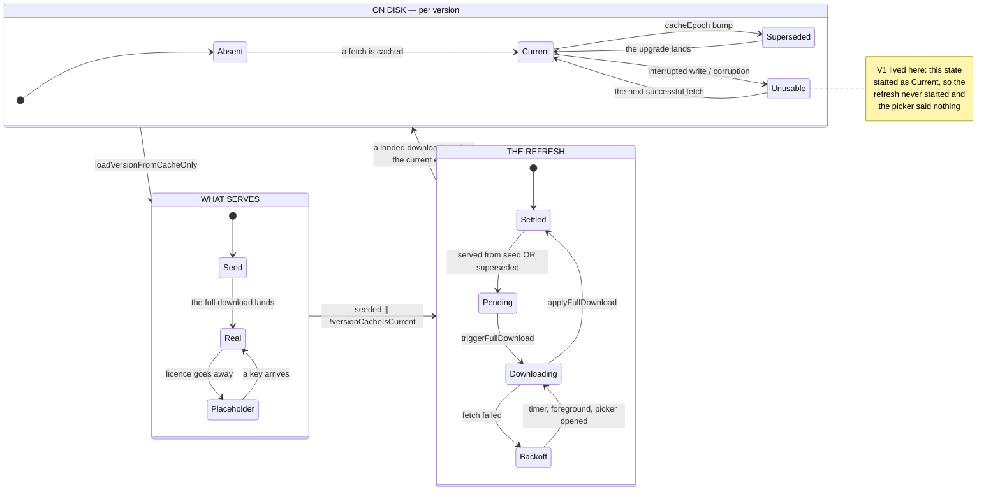

# A Bible version, as a state machine

> **Status.** Three of the seven machines are enumerated — storage (M1),
> credentials (M2) and refresh (M3) — and the refresh file also carries the
> TRAJECTORY harness, which walks journeys rather than cells. As of
> 2026-08-28 they cover 185 cells and 310 journeys and record **zero**
> incoherent states. **Every defect the scouting reported has now been closed
> — eighteen in all**: `V1` (a silent stale-serve), `V2` (its root cause, an
> unsynced cache write), `D1` (a destructive purge on an answer the app could
> not verify), `D2` (licensed text retained with an unbounded lifetime), `D3`
> (a non-default translation stale in silence), `D4` (a banner outliving the
> seed), `D5` (a notice unreachable from the only surface that shows it),
> `D6` (a downloaded Bible discarded because it could not be cached), `D7`
> (a path algebra that could delete a live cache), `D8` (miss branches
> disagreeing about the mode they report), `D9` (**the reader's chosen
> translation erased by a condition that fixes itself**), `D10` (a silent
> substitution of one translation for another) `D11` (a notice retired
> while the edition it describes is still on screen) `D12` (a dead link
> honoured behind the reader's back), `D13` (**someone else's link spending
> the reader's remembered translation**), `D14` (a displaced link discarded in
> silence), `D15` (one translation's search results read and navigated under
> another's name) and `D16` (**a wider canon's trail deleted for reading a
> narrower translation**). Anything a future change breaks appears as an
> unpinned violation, by name.

## Why a state machine and not a checklist

What a version serves is decided by seven functions that each ask a slightly
different question about the same files on disk — *does a cache exist, does it
load, is it current, is it stale, may it be served, may it be deleted, may it
be replaced* — and the reader sees only the answer, never which function gave
it. When two of those questions disagree, the disagreement is invisible: the
reader is simply looking at the wrong text, with no symptom to report and no
control that repairs it.

That is the rule this document exists to hold:

> **The reader is never silently served text that is not the best the app can
> give them — and every state that falls short says so and offers a way out.**

It is the data-layer twin of the shared-link document's liveness rule, and the
`docs/BACKLOG.md` entry that asked for this model named it as the standing
invariant to check. `V1` broke it in shipped code.

## The shape of the thing

The narrow place is the arrow from `D` to `R`. The refresh decision is taken
by a **second, independent probe** of the same disk state that the serve path
already examined — and for the whole life of the code that probe was
`os.Stat`, while the serve path was a full load. Two questions, two answers,
one reader.

## State variables

| Variable | Where | What it means |
|---|---|---|
| the cache file at `cachePathForVersion(id)` | disk | the current epoch's text |
| the files at `supersededCachePaths(v)` | disk | previous epochs, newest first |
| `cacheEpoch` | `versions.go` registry | which decoder wrote the current file |
| `AppState.fullPending` | memory | an upgrade is owed |
| `AppState.seedOnly` | memory | what serves is the 4-book seed |
| `AppState.fullDownloading` | memory | single-flight guard |
| `AppState.fullRetryDelay` | memory | bounded backoff, 0 when settled |
| `dataMode` | memory | `modeReal` vs a `modeTesting` placeholder |
| the credential trio | keychain / env | whether a licensed source is `available()` |

`fullPending` is computed **for the default version only**, whatever
translation the reader is restored onto — see `V8` in the register.

## The states

**Absent.** No cache at any epoch. A first run serves the embedded Gospels
seed (`seedOnly`), and the full download is pending. Legal and announced: the
picker says the full text is still downloading.

**Current.** The current epoch loads. Nothing is owed; the refresh is settled.

**Superseded-serving.** The current epoch is missing and a previous epoch
loads. This is a *deliberate* stale-serve — the epoch-migration fallback that
exists so an offline upgrader keeps their whole canon and their history rather
than dropping to a 4-book seed. It is legal **only because** it is announced
and repaired: `versionCacheIsCurrent` is false, so `fullPending` is set, the
background upgrade runs, and the picker says an update is waiting.

**Unusable-current.** A file exists at the current epoch and cannot be served.
Before the fix this state *pretended to be Current* — see `V1`.

**Placeholder.** A licensed version with no credentials. Selectable only in
the sense that the picker explains how to unlock it.

**Licensed-stale.** A licensed cache past the 30-day recency window
(`licensedRecencyWindow`). Never served: the fast path reports a miss so the
load path revalidates. This is the §11 obligation and the one place where
"stale" means *refuse*, not *serve and repair*.

## Transitions

| From | Event | Code | Lands in |
|---|---|---|---|
| any | launch | `loadStartupBible` (`app.go`) | cache hit → **Current**/**Superseded-serving**; miss + saved reading → full load; miss, no history → **Seed** |
| **Absent** | full download lands | `applyFullDownload` (`app.go`) | **Current**, `fullPending` cleared |
| **Current** | `cacheEpoch` bump | registry edit + release | **Superseded-serving** at the next launch |
| **Superseded-serving** | upgrade lands | `loadVersionData` → `purgeSupersededCaches` | **Current**, old epochs removed |
| **Superseded-serving** | fetch fails | `triggerFullDownload` tail | **Backoff** (20 s doubling, capped), notice says "waiting for a connection" |
| **Backoff** | foreground, timer, or the picker being opened | `app.go`, `versions_ui.go` | **Downloading** |
| **Current** | interrupted write | `saveBibleToCache` | **Unusable-current** — made unreachable by the fsync (`V2`) |
| **Placeholder** | a key arrives | `keyStore` write → picker re-derive | **Current**/**Absent** for that version, `modeReal` |
| **Licensed-stale** | any load | `licensedCacheStale` → `os.Remove` → refetch | **Current**, or an error — never a stale serve |
| any | purge | `purgeSupersededCaches`, only from inside a *successful* load | previous epochs removed; the current one never touched |

The purge's precondition is the important one, and it is why the enumeration
drives it through `loadVersionData` rather than calling it: purging first, and
discovering the network was down second, is how a reader lost their only copy
once already. Calling the purge directly in a test invents states the app does
not have — and an enumeration that invents states reports defects that are not
real.

## Invariants

These are what `version_state_flow_test.go` enforces. A change that breaks one
is a regression even if every existing test stays green.

- **V-A — Nothing is served that was not loadable.** No path returns text and
  an error together, and no probe reports a file as usable that the serve path
  would reject. *Was violated by `V1`; fixed.*
- **V-B — A superseded serve is always scheduled for upgrade.** If what
  reaches the reader came from a previous epoch, `fullPending` is set.
  *Was violated by `V1`; fixed.*
- **V-C — A stale-serving state is never silent.** Every state in which the
  reader is not looking at the best available text has a notice that says so
  — the picker footer, or the seed banner. *Was violated by `V1`; fixed.*
- **V-D — A purge never removes the only readable copy.** Superseded epochs
  are deleted only after a verified successful load of the current one.
- **V-E — Licensed text is never served past its window.** The recency check
  governs the serve, not merely the refresh.

## Incoherent states

Every entry was reached by driving the real functions. `cells` is how many of
the enumerated combinations reach it — not a count of defects, but a measure
of how much of the space the defect covers.

| # | Name | Exists today | Cells | What it costs the reader |
|---|---|---|---|---|
| ~~V1~~ | ~~An unusable current-epoch cache serves the previous epoch silently~~ | **FIXED 2026-08-28** | 0 | — |
| ~~V2~~ | ~~A cache write is renamed without being synced~~ | **FIXED 2026-08-28** | 0 | — |
| ~~D1~~ | ~~A credential store that fails to answer is actioned as a revoked licence, and the reader's only copy is deleted~~ | **FIXED 2026-08-28** | 0 | — |
| ~~D4~~ | ~~The seed banner outlives the seed and draws over the complete text~~ | **FIXED 2026-08-28** | 0 | — |
| ~~D5~~ | ~~The waiting notice is unreachable from the only surface that shows it~~ | **FIXED 2026-08-28** | 0 | — |
| ~~D2~~ | ~~Superseded epochs of a licensed translation are retained forever, unreadable and never age-checked~~ | **FIXED 2026-08-28** | 0 | — |
| ~~D3~~ | ~~A non-default translation serving a superseded epoch is stale in silence~~ | **FIXED 2026-08-28** | 0 | — |
| ~~D6~~ | ~~A downloaded Bible is discarded because it could not be cached~~ | **FIXED 2026-08-28** | 0 | — |
| ~~D7~~ | ~~An unregistered version's current cache path appears in its own superseded list~~ | **GUARDED 2026-08-28** | 0 | — |
| ~~D8~~ | ~~The cache-only read's miss branches disagree about the mode~~ | **FIXED 2026-08-28** | 0 | — |
| ~~D9~~ | ~~A translation that is merely unselectable this launch has the reader's choice overwritten by the fallback, permanently~~ | **FIXED 2026-08-29** | 0 | — |
| ~~D10~~ | ~~The reader asked for one translation and is shown another, with nothing on any surface saying so~~ | **FIXED 2026-08-29** | 0 | — |
| ~~D11~~ | ~~A stale version's notice is retired by the disk while its previous decode is still on screen~~ | **FIXED 2026-08-29** | 0 | — |
| ~~D12~~ | ~~A link whose translation failed to load keeps its park, and a later unrelated switch honours the dead link~~ | **FIXED 2026-08-29** | 0 | — |
| ~~D13~~ | ~~A link switching translations spends the reader's remembered fallback choice, durably and in silence~~ | **FIXED 2026-08-29** | 0 | — |
| ~~D14~~ | ~~A link displaced by another translation's load is dropped with nothing said~~ | **FIXED 2026-08-29** | 0 | — |
| ~~D15~~ | ~~Search results survive a switch: old wording under a new name, and a tap writes a dead reference~~ | **FIXED 2026-08-29** | 0 | — |
| ~~D16~~ | ~~A wider canon's history is offered dead after a switch and deleted at the next launch~~ | **FIXED 2026-08-29** | 0 | — |

### V1 — FIXED 2026-08-28

`versionCacheIsCurrent` asked `os.Stat`; the serve path asked for a full load.
A file that existed and could not be served — a write interrupted after the
rename, a truncated file, a wrong-schema file, a directory at the path —
answered *current* to the first question and *miss* to the second. The
consequences compounded: the epoch-migration fallback served the previous
decoder's text, `fullPending` was false so no upgrade was scheduled, the
picker's notice was empty because it keys off `fullPending`, the picker's
manual retry was inert for the same reason, and the foreground hook was too.
Nothing in the session repaired it — `switchVersion` short-circuits on the
already-loaded map — and the next launch reproduced it exactly. The reader
had no symptom to report and no control to press.

The fix makes the two questions the same question: `versionCacheIsCurrent`
now loads. Measured cost, on the background load goroutine that has just done
the same parse: ~50 ms for the 6.3 MB WEB cache on an M3 Max.

### V2 — FIXED 2026-08-28

`saveBibleToCache` wrote a temp file and renamed it. The rename is atomic
against a concurrent reader but is not a durability barrier: after a power
loss or an iOS jetsam kill the new name can be visible while the megabytes
behind it are not. That is precisely the input to `V1`. The write now fsyncs
the temp file before the rename, so the cache on disk is always either the
previous whole file or the new whole file.

### D1 — FIXED 2026-08-28

`purgeUnavailableLicensedCaches` deleted the current epoch and every
superseded epoch of any licensed version whose `available()` was false. But
`available()` is false in two quite different situations: the reader has no
key, and *the app could not find out*. `secretStore.Read` returns
`(value, found, ok)`, and its own contract says `ok=false` means the store
failed and "CALLERS MUST NOT treat that as 'no key'" — before the first unlock
after a reboot, or on any store error other than item-not-found. Every
consumer that merely reads a key honours that; the one consumer that acted
irreversibly did not.

The cost was the worst shape available: an offline reader, whose licence was
perfectly intact, losing their only local copy of a translation, at startup,
with nothing to restore it from.

The purge now requires a definitive negative — `keyStore.bibleKeyKnownAbsent`,
which answers `false` when the store did not answer at all. The requirement is
scoped to versions whose availability actually turns on the key, so a version
unavailable for a deterministic reason (no operator opt-in, no provider id)
stays purgeable and the §10 removal obligation is unweakened.

### D4 and D5 — FIXED 2026-08-28, and what found them

These two are the reason the suite now has a second kind of harness.

`D4` is a **flow** defect: `applyFullDownload` cleared `seedOnly` on the path
that swaps the text in, and returned early — without clearing it — on the path
taken when the reader has switched to another translation meanwhile. Every
step is individually correct. Only the composition is wrong: fresh install on
the seed, switch away, the download lands while away, switch back — and the
complete text is on screen under a banner still announcing the four-book seed.
The refresh cross-product walked 160 cells and found nothing; the trajectory
walk found it in 310 journeys, because no cell is a sequence.

`D5` is neither a wrong state nor a wrong journey but an **unreachable** one.
The picker fires the manual retry and computes its notice twenty lines later —
and the retry sets `fullDownloading` synchronously while zeroing the backoff,
so both halves of the waiting condition are false by the time it is read. The
wording written for a reader waiting offline could never be shown by the only
surface that shows it. A reachability property needs its own assertion: no
single cell is incoherent, the space is. The picker now reads the notice
first, through `noticeOnPickerOpen`, so the footer reports the situation the
reader came to ask about rather than the side effect of their asking.

### D2 and D3 — FIXED 2026-08-28

`D2` is a **retention** defect rather than a reading one. A licensed
superseded epoch can never be served — the licensed branch returns before the
superseded walk, because stale licensed text must be revalidated rather than
served — and the recency machinery only ever age-checks the *current* epoch.
So the file was unreadable by the app and invisible to the obligation that
governs it: licensed text on the reader's device with an unbounded lifetime
and nothing that would ever look at it again. The startup sweep now removes
superseded epochs of licensed versions unconditionally. The test carries the
control that makes that safe — it proves the file cannot be served before
deleting it — and its twin proves the **public-domain** lane is untouched,
because there the superseded epoch is the offline upgrader's whole canon.

`D3` is a **coupling** defect, and the reason the map matters. M1 knows a
version is serving a superseded epoch; M3 computes `fullPending` from the
default version alone and re-targets it deliberately. Both correct in
isolation. Together they meant a reader restored onto another translation
offline — or switched onto one whose fetch failed — read the previous
decoder's output with no notice, no banner and no upgrade for the entire
session, and it could not self-heal because the switch path short-circuits on
the already-loaded map. This is exactly the silence `V1` was, in a place
`V1`'s fix does not reach.

Staleness is now recorded per version (`AppState.staleVersions`) at both
fallback sites, reported by the picker in the reader's own translation's name,
and cleared by the only thing that repairs it — that version loading its
current epoch. The seed keeps precedence when both are true, because the seed
is what is on screen.

### D6, D7 and D8 — closed 2026-08-28

`D6`: a fetch that succeeded but could not be written was discarded whole.
That made an unwritable cache directory indistinguishable from being offline
at every call site — including the retry loop, which then retried forever at
ten-minute intervals with no possibility of success, on a device where the app
could never open a version at all. The download now reaches the reader for the
session and the failure is logged; the next launch tries the cache again.

`D7` is unreachable in production and a live trap for tests: the current path
is registry-resolved and the superseded list is value-resolved, so an
UNREGISTERED version with an epoch has its current path inside its own
superseded list — and a purge would delete the live cache. Guarded by an
invariant over the real registry, and avoided in the suites by registering
every constructed version.

`D8`: the cache-only read's four miss branches reported two different modes.
Harmless while every caller checks the error first — but one of them already
assigns the returned mode on its success path, so it was one reader away from
mattering. Every miss now reports the same mode, pinned.

### D9 and D10 — the launch machine, closed 2026-08-29

These are the first two found by enumerating **M5 x M6 x M7 together**, and
neither is visible inside any one of them. They are also the first defects in
this document that are **durable**: every earlier one cost the reader a
session, and these rewrite the only copy of something they cannot re-derive.

`D9` is `D1`'s shape in a new machine — a non-definitive answer driving an
irreversible act — and it is the M2 x M6 coupling the map predicted. A
licensed translation stops being selectable whenever its licence configuration
cannot be **read**, and a credential store that has not unlocked yet answers
exactly like one that is empty. On iOS, an app launched before first unlock is
a routine morning. The restore's saved-translation block is skipped entirely
for an unselectable version, so the fallback-remembering line inside it never
ran: `preferredVersion` stayed empty, and the reader's next navigation
persisted the fallback's id over their own. The comment on that line already
promised this could not happen ("without this, one offline launch would
overwrite `nkjv` with `web` permanently") — the promise was true only for the
route it guarded. The choice is now recorded before the block, on the
condition that the translation still exists in the build at all.

`D10` is the silence around the same event. Even on the route that worked, a
reader who asked for one translation and was handed another was told nothing:
the picker put its check mark on the fallback, citations named the fallback,
and the substitution was invisible. The picker footer — the surface that
answers *which translation am I on*, and the one `D3` uses — now says it, and
says the choice is remembered, which is only true because `D9` made it so.

**What the enumeration did NOT find is worth as much.** `L-B`, the
history-erasure invariant that this whole document descends from, is not
violated in any of the sixteen cells — including a 73-book trail meeting a
66-book fallback, the exact shape of the original incident. The guards that
were added by hand hold up under enumeration.

### D11 — the selection machine, closed 2026-08-29

`M4` is the only machine that keeps a **second copy** of a translation — the
in-memory `loadedVersions` map — and a second copy is a second source of
truth. The cross-product asks one question: can the map and the disk disagree
about the same translation, and does anything notice.

They can, at `mem-previous/disk-current`. A version recorded as showing a
previous edition holds that old decode in memory. If the current epoch then
arrives on disk, the switch serves memory — and `applyLoadedVersion` decides
staleness by asking the **disk**, so it retires the notice while the old text
is still on screen. The reader is told the edition is current, and it is not.

**On reachability, plainly.** Nothing in the app today writes a non-default
version's current epoch while that version's previous decode sits in memory:
the background refresh only upgrades the default translation, and a version
already in memory is never re-read from disk. So this is a guard in `D7`'s
sense rather than a live defect — but a far shorter reach than `D7`'s, because
the feature that makes it live is the obvious next one, and `D3`'s notice
already promises it ("until the update can be downloaded"). The fix also
closes a hole that IS live: before it, a non-default translation recorded as
stale had **no way to stop being stale within a session**, however long the
reader spent online — a straight violation of the liveness invariant.

**A note on the enumeration itself.** Its first version passed, and proved
nothing: it routed the generation stamp through `M1`'s `servedFrom` helper,
which maps anything it does not recognise to `"none"`, so every
previous-edition assertion was a tautology. The stamp is now read directly,
and `TestTheSelectionInvariantsCanActuallyFail` hands the invariants the
shapes they exist to catch and requires them to complain — because a green
suite is evidence only when the checks in it can go red.

### D12 — the arrivals layer, closed 2026-08-29

The arrivals layer is walked as **journeys**, not cells, and the reason is in
what an arrival is. The seven machines are enumerated as cells because each of
their defects is a wrong answer to one question. An arrival is not a question,
it is a **promise**: the reader tapped something, and the app owes them either
the passage or a sentence. A promise is kept or broken over time, and every
way it breaks is a sequence — a park that outlives the load it waited for, a
park consumed by an action taken for a different reason, an arrival reported
failed and then honoured anyway. None of those is visible in any single state.

780 journeys to depth four found four distinct broken promises, all one root
cause. A shared link naming a translation not in memory parks its target and
lets that load own the spinner. On the arm where the load fails and the
previous-epoch cache cannot help either, the reader is shown the error — and
the park is left behind. It is not inert: `applyLoadedVersion`'s tail consumes
a park whose id matches, so the reader who later picks that same translation
from the picker, for their own reasons and long after being told the link
failed, is **silently moved to the dead link's passage**. The park is now
closed with the promise, and only ours — a target waiting on a different
translation belongs to another load that still has its own consumer, and
clearing every park would trade this defect for its mirror image. Both halves
are pinned.

The passage is deliberately **not** opened in the translation the reader
already has. Re-applying the target would call `switchToLinkVersion` again and
restart the very fetch that just failed; stripping the version to dodge that
would file the sender's note against wording it was never about — the one
thing `applyShareTarget` is written to prevent. The error card is the answer,
and the link is still in the reader's messages.

**This is the third confirmation that cross-products are blind to flow.** The
refresh machine's 160 cells found nothing and its 310 journeys found `D4`; the
arrivals layer's defects are invisible to every cross-product in this suite
and its 780 journeys found `D12` by four different routes. The existing
`share_link_flow_test.go` cross-product is not made redundant by this — it
asks a different question over the link's own axes ("is any state a dead
end"), and it still passes.

### D13–D16 — what the model missed, found by scouting the same ground again

The journeys above found `D12` and then went quiet, so the four arrival
surfaces were read again from scratch, independently, and each candidate put
to two adversarial verifiers on separate lenses (is it reachable, and does
anything actually go wrong). Four survived, all confirmed here against the
real code before anything was changed. **Two are durable.** They are recorded
together because they share a cause the model had not named: **a reference or
a record made in one translation, read back in another** — and every one of
them arrives through a caller that no machine in the map owns.

`D13` is the sharpest thing in this document, because it is a fix creating an
obligation elsewhere. `D10` made the app *promise*, in writing on the picker,
that the reader's translation is "remembered and comes back when it can".
`applyLoadedVersion` then spent that record on any successful load — its
comment naming two callers, "the reader picked it" and "the licensed one came
back". **A tapped link is neither.** So a reader in the fallback state whose
friend sends them a verse in some other translation lost the only record of
what they had chosen, at the moment of the tap, with the notice going silent
in the same breath. Not their doing, not announced, not recoverable. Switches
an arrival performs are now marked as such, and the preference survives them —
except when the link is *to* the chosen translation, which is exactly it
coming back.

`D16` is the original incident arriving by a door the launch enumeration does
not have. `L-B` proves a trail survives a launch that falls back; nothing
proved it survives the reader simply **changing translation**, which is the
ordinary thing the app is for. An evening in the WEBC leaves Tobit, Sirach and
1 Maccabees in the trail; switching to the WEB persisted that trail under
`"web"`, and the next launch validated it against 66 books and deleted all
three from the only copy. The two cases `restoreRecent` could not tell apart
are not alike — a book dropped from the *build* is gone, a book missing from
the translation the reader *happens to be in* is still theirs. Entries the
app's widest canon knows are now kept dormant rather than deleted, and
`recentJumpTargets` — the single place every renderer of the bar reads — does
not offer what the loaded canon cannot resolve. They come alive again the
moment the reader returns to a canon that has them.

`D15` is the same shape one layer up. A search result list is made of Verses
carrying the **old translation's wording**; it survived a switch, so the
reader read one translation's text under another's name, and tapping a row
navigated by the old numbering into a canon that need not contain the book —
a blank chapter with both arrows dead, written into the reading position and
the history. The mark beside those results was *already* renumbered on every
switch for exactly this reason; the results were the half nothing re-derived.
They are now re-run against the translation in hand, and the navigation
carries the canon guard for every other producer of a Verse.

`D14` is a dead end of precisely the kind `share_link_flow_test.go` exists to
forbid, reached by an axis that enumeration does not have. A link tapped while
some other translation is downloading parks behind that load; when the other
one lands it takes the screen and the park is dropped — correctly, the target
is stale — but until now without a word, and the platform glue has already
told the OS the link was handled, so there is no browser fallback either. Two
taps on shared scripture and nothing whatever happens. The drop was right; the
silence was the defect.

**What this says about the method.** The journeys were necessary and not
sufficient. Their axes were the ones the model already knew to look at, so
they could only find defects among those — `D12`, and nothing further. The
four that follow all live on couplings the map had not drawn: a link reaching
the preference machinery, a switch reaching the search list, a switch reaching
durable history. Re-reading the same ground with no model in hand is what
found them, and adversarial verification is what kept the count honest — a
fifth candidate was refuted on consequence and is not in this table.

## The whole machine — what a complete model must cover

This document began as the storage question and grew into the map below,
because the question a reader actually has is not *which file serves this
version* but:

> **Which text am I looking at, is it the best this app can give me, and does
> everything that names it tell the truth?**

That is seven coupled machines and an arrivals layer, not one machine.
Enumerating them as one cross-product is neither possible nor useful; the
notes model already showed the alternative, running two separate enumerations
rather than one. So each machine below is enumerated on its own, and only the
couplings that are real get crossed.

### The machines

| | Machine | States |
|---|---|---|
| **M1** | Per-version storage *(enumerated)* | absent · current · superseded · unusable · licensed-stale — **a vector over versions, not a scalar** |
| **M2** | Credential and licence *(enumerated)* | unconfigured · bundled · BYOK · cleared-sticky · **unreadable-transient** · recency fresh/expired |
| **M3** | Refresh and download | settled · pending · downloading · backoff(n) · unpersistable-loop |
| **M4** | Active selection *(enumerated)* | `CurrentVersion` + the `loadedVersions` map — **memory and disk can disagree** |
| **M5** | App lifecycle *(enumerated, with M6+M7)* | loadPending · loadReady · loadFailed · foreground · background · teardown |
| **M6** | Reading position *(enumerated, with M5+M7)* | the saved state NAMES a version that may be gone, unlicensed, or uncached |
| **M7** | Canon shape *(enumerated, with M5+M6)* | 66 vs 73 books, and the renumbering between any two versions |

M2 is the machine with a state that is not a fact about the world but about
**our knowledge of it**: `unreadable-transient` is "we cannot tell", and the
whole of `D1` is one consumer treating it as "no".

M7 is the machine that makes wrong answers look right: `notes_anchor.go`
records in its own header that `MapVerse(webc->web, Tobit 1:1)` reports EXACT
— *and that the table lies*.

### The arrivals layer

Events that arrive from outside and collide with whatever state the machines
are in. Each crosses several machines at once, which is why they are the
richest source of incoherence:

- a **shared link** names a version AND a passage — which may be unavailable,
  unlicensed, undownloaded, or absent from that canon (`linkVersionUnavailable`
  already exists, so the state is real and only partly modelled);
- a **shared note** is STORED under a version — `docs/NOTES_STATE.md` models
  the note side exhaustively and the version side not at all;
- **search results** are version-scoped verse references held across a switch;
- a **cold-start deep link** arrives before the load phase ends (arrivals x M5);
- **audio and read-along** recordings are per version;
- the **footnote apparatus** is per version;
- **cross-references** and **verse-of-the-day** are 66-book data with no
  deuterocanonical entries.

### The surfaces that must not lie

Every degraded state must be visible, so every surface that names or implies a
version is a place a state can lie: the reading pane, the picker rows (check,
greyed, locked tag, TESTING badge), the picker footer notice, the
incomplete-Bible banner, **share citations** (which name the translation to
someone else), note bubbles, and audio availability.

### The invariants a complete model needs

V-A..V-E above are storage-only. The full set:

1. **Truth** — nothing on screen names a version other than the one being shown.
2. **Liveness** — every degraded state offers a way forward and says so.
3. **Non-destruction** — nothing deletes the reader's only copy.
4. **Compliance** — licensed text is never served past its window, nor retained
   without a licence.
5. **One ruler** — every verse number in play is in the numbering of the
   version being read.
6. **No one-way doors** — no state is unrecoverable within a session.
7. **Arrival safety** — an inbound link, note or result never lands the reader
   somewhere they cannot get back from.

### Order of work

Credentials (M2) first: the two destructive defects live there. Then
launch/restore x canon (M5 x M6 x M7), which is where the history-erasure
incident came from. **Both are done, and so is M4**
(active selection — the one machine where memory and disk can disagree). All
seven machines are enumerated, **and so is the arrivals layer** — as journeys
rather than cells, for the reason `D12` records. The model is complete as
mapped.

## What is enumerated, and what is not

**M1, storage** — five disk shapes × three events, every cell reached, none
skipped, plus the licensed recency boundary from both sides and the four
unusable-file shapes.

**M2, credentials** — five knowledge states (absent, held, unreadable,
legacy-only, unreadable-with-legacy) × two events, including the irreversible
one. The keystone is a credential store that can *fail*, which no existing
fake could do.

**M3, refresh** — 160 cells across pending × seed × downloading × backoff ×
which version is active, and **310 journeys** to depth 4 from the two starting
states a launch can really produce, with the invariants asserted after every
step. The trajectory harness is the instrument for flow, and the two numbers
are its argument: the cells found nothing, the journeys found `D4`.

Not yet enumerated, and therefore not claimed: **M4–M7** and the arrivals
layer. The remaining reported defects (`D2`–`D8`) live in those spaces and are
recorded in `docs/BACKLOG.md` as reports to confirm with a cell — not here,
because this document names only what an enumeration has actually driven.
