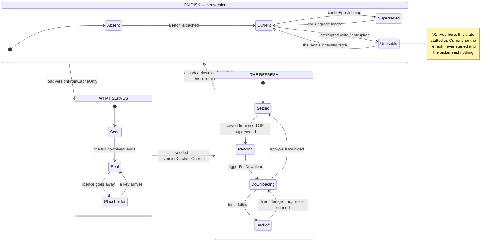

# A Bible version, as a state machine

> **Status.** The model below is enumerated by `version_state_flow_test.go`,
> which drives the real functions across the cross-product of disk states and
> events. As of 2026-08-28 the enumeration walks 15 storage cells and records
> **zero** incoherent states: `V1` was found by the enumeration and fixed in
> the same change, and its root cause `V2` with it. Anything a future change
> breaks appears there as an unpinned violation, by name.

## Why a state machine and not a checklist

What a version serves is decided by seven functions that each ask a slightly
different question about the same files on disk — *does a cache exist, does it
load, is it current, is it stale, may it be served, may it be deleted, may it
be replaced* — and the reader sees only the answer, never which function gave
it. When two of those questions disagree, the disagreement is invisible: the
reader is simply looking at the wrong text, with no symptom to report and no
control that repairs it.

That is the rule this document exists to hold:

> **The reader is never silently served text that is not the best the app can
> give them — and every state that falls short says so and offers a way out.**

It is the data-layer twin of the shared-link document's liveness rule, and the
`docs/BACKLOG.md` entry that asked for this model named it as the standing
invariant to check. `V1` broke it in shipped code.

## The shape of the thing

The narrow place is the arrow from `D` to `R`. The refresh decision is taken
by a **second, independent probe** of the same disk state that the serve path
already examined — and for the whole life of the code that probe was
`os.Stat`, while the serve path was a full load. Two questions, two answers,
one reader.

## State variables

| Variable | Where | What it means |
|---|---|---|
| the cache file at `cachePathForVersion(id)` | disk | the current epoch's text |
| the files at `supersededCachePaths(v)` | disk | previous epochs, newest first |
| `cacheEpoch` | `versions.go` registry | which decoder wrote the current file |
| `AppState.fullPending` | memory | an upgrade is owed |
| `AppState.seedOnly` | memory | what serves is the 4-book seed |
| `AppState.fullDownloading` | memory | single-flight guard |
| `AppState.fullRetryDelay` | memory | bounded backoff, 0 when settled |
| `dataMode` | memory | `modeReal` vs a `modeTesting` placeholder |
| the credential trio | keychain / env | whether a licensed source is `available()` |

`fullPending` is computed **for the default version only**, whatever
translation the reader is restored onto — see `V8` in the register.

## The states

**Absent.** No cache at any epoch. A first run serves the embedded Gospels
seed (`seedOnly`), and the full download is pending. Legal and announced: the
picker says the full text is still downloading.

**Current.** The current epoch loads. Nothing is owed; the refresh is settled.

**Superseded-serving.** The current epoch is missing and a previous epoch
loads. This is a *deliberate* stale-serve — the epoch-migration fallback that
exists so an offline upgrader keeps their whole canon and their history rather
than dropping to a 4-book seed. It is legal **only because** it is announced
and repaired: `versionCacheIsCurrent` is false, so `fullPending` is set, the
background upgrade runs, and the picker says an update is waiting.

**Unusable-current.** A file exists at the current epoch and cannot be served.
Before the fix this state *pretended to be Current* — see `V1`.

**Placeholder.** A licensed version with no credentials. Selectable only in
the sense that the picker explains how to unlock it.

**Licensed-stale.** A licensed cache past the 30-day recency window
(`licensedRecencyWindow`). Never served: the fast path reports a miss so the
load path revalidates. This is the §11 obligation and the one place where
"stale" means *refuse*, not *serve and repair*.

## Transitions

| From | Event | Code | Lands in |
|---|---|---|---|
| any | launch | `loadStartupBible` (`app.go`) | cache hit → **Current**/**Superseded-serving**; miss + saved reading → full load; miss, no history → **Seed** |
| **Absent** | full download lands | `applyFullDownload` (`app.go`) | **Current**, `fullPending` cleared |
| **Current** | `cacheEpoch` bump | registry edit + release | **Superseded-serving** at the next launch |
| **Superseded-serving** | upgrade lands | `loadVersionData` → `purgeSupersededCaches` | **Current**, old epochs removed |
| **Superseded-serving** | fetch fails | `triggerFullDownload` tail | **Backoff** (20 s doubling, capped), notice says "waiting for a connection" |
| **Backoff** | foreground, timer, or the picker being opened | `app.go`, `versions_ui.go` | **Downloading** |
| **Current** | interrupted write | `saveBibleToCache` | **Unusable-current** — made unreachable by the fsync (`V2`) |
| **Placeholder** | a key arrives | `keyStore` write → picker re-derive | **Current**/**Absent** for that version, `modeReal` |
| **Licensed-stale** | any load | `licensedCacheStale` → `os.Remove` → refetch | **Current**, or an error — never a stale serve |
| any | purge | `purgeSupersededCaches`, only from inside a *successful* load | previous epochs removed; the current one never touched |

The purge's precondition is the important one, and it is why the enumeration
drives it through `loadVersionData` rather than calling it: purging first, and
discovering the network was down second, is how a reader lost their only copy
once already. Calling the purge directly in a test invents states the app does
not have — and an enumeration that invents states reports defects that are not
real.

## Invariants

These are what `version_state_flow_test.go` enforces. A change that breaks one
is a regression even if every existing test stays green.

- **V-A — Nothing is served that was not loadable.** No path returns text and
  an error together, and no probe reports a file as usable that the serve path
  would reject. *Was violated by `V1`; fixed.*
- **V-B — A superseded serve is always scheduled for upgrade.** If what
  reaches the reader came from a previous epoch, `fullPending` is set.
  *Was violated by `V1`; fixed.*
- **V-C — A stale-serving state is never silent.** Every state in which the
  reader is not looking at the best available text has a notice that says so
  — the picker footer, or the seed banner. *Was violated by `V1`; fixed.*
- **V-D — A purge never removes the only readable copy.** Superseded epochs
  are deleted only after a verified successful load of the current one.
- **V-E — Licensed text is never served past its window.** The recency check
  governs the serve, not merely the refresh.

## Incoherent states

Every entry was reached by driving the real functions. `cells` is how many of
the enumerated combinations reach it — not a count of defects, but a measure
of how much of the space the defect covers.

| # | Name | Exists today | Cells | What it costs the reader |
|---|---|---|---|---|
| ~~V1~~ | ~~An unusable current-epoch cache serves the previous epoch silently~~ | **FIXED 2026-08-28** | 0 | — |
| ~~V2~~ | ~~A cache write is renamed without being synced~~ | **FIXED 2026-08-28** | 0 | — |

### V1 — FIXED 2026-08-28

`versionCacheIsCurrent` asked `os.Stat`; the serve path asked for a full load.
A file that existed and could not be served — a write interrupted after the
rename, a truncated file, a wrong-schema file, a directory at the path —
answered *current* to the first question and *miss* to the second. The
consequences compounded: the epoch-migration fallback served the previous
decoder's text, `fullPending` was false so no upgrade was scheduled, the
picker's notice was empty because it keys off `fullPending`, the picker's
manual retry was inert for the same reason, and the foreground hook was too.
Nothing in the session repaired it — `switchVersion` short-circuits on the
already-loaded map — and the next launch reproduced it exactly. The reader
had no symptom to report and no control to press.

The fix makes the two questions the same question: `versionCacheIsCurrent`
now loads. Measured cost, on the background load goroutine that has just done
the same parse: ~50 ms for the 6.3 MB WEB cache on an M3 Max.

### V2 — FIXED 2026-08-28

`saveBibleToCache` wrote a temp file and renamed it. The rename is atomic
against a concurrent reader but is not a durability barrier: after a power
loss or an iOS jetsam kill the new name can be visible while the megabytes
behind it are not. That is precisely the input to `V1`. The write now fsyncs
the temp file before the rename, so the cache on disk is always either the
previous whole file or the new whole file.

## What is enumerated, and what is not

The suite walks the **storage space** — five disk shapes × three events, every
cell reached, none skipped — plus the licensed recency boundary from both
sides and the four unusable-file shapes.

Not yet enumerated, and therefore not claimed: the **launch space** (saved
reading × seed usability × fetch outcome, through `loadStartupBible`) and the
**download space** (`fullPending` × `seedOnly` × `fullDownloading` × backoff ×
the apply/retry/picker events). The scouting for both is recorded in
`docs/BACKLOG.md`; several suspected defects in those spaces are named there
rather than here, because this document only claims what the enumeration has
actually driven.
